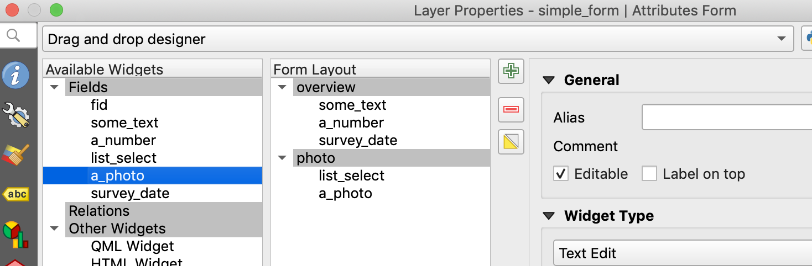
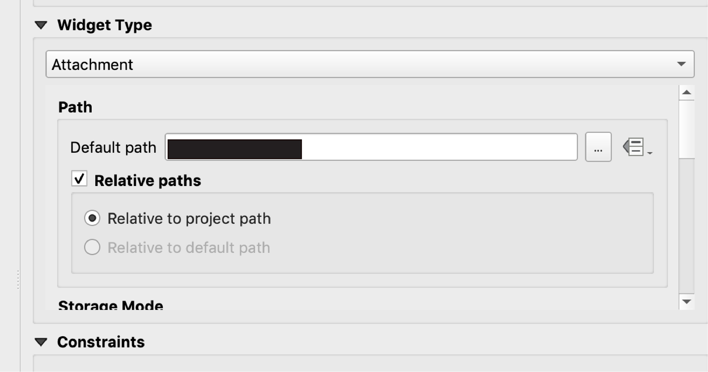

```{r setup, include=FALSE}
knitr::opts_chunk$set(echo = TRUE)
```

## Setup

#### QGIS

QGIS is an open-source desktop GIS. In order to complete this training you will need a desktop with [QGIS](https://www.qgis.org/en/site/index.html) installed. You can download the latest desktop version of QGIS for your operating system [here](https://www.qgis.org/en/site/forusers/download.html).

Various training resources exist for QGIS; [A Gentle Introduction to GIS](https://docs.qgis.org/3.4/en/docs/gentle_gis_introduction/index.html) is a good option.

#### QField 

You will need to install QField onto a mobile device (phone or tablet) running the Android operating system. You can install QField from the Google Play Store. QField is based on QGIS and provides a simple touch-optimized user interface for collecting and editing geospatial data using mobile devices. You can find more information about QField on its [documentation](https://qfield.org/docs/index.html) site.


<center>
<iframe src="https://player.vimeo.com/video/173774749" width="640" height="360" align="middle" frameborder="0" allow="autoplay; fullscreen" allowfullscreen></iframe>
<p><a href="https://vimeo.com/173774749">Photo functionality in QField</a> from <a href="https://vimeo.com/user36168865">OPENGIS.ch</a> on <a href="https://vimeo.com">Vimeo</a>.</p>
</center>

#### QField Sync Plugin

The [QField Sync](https://qfield.org/docs/qfieldsync/index.html) plugin helps move projects and associated data between QGIS and QField and vice versa. 

In QGIS, go to the plugin library and search for *QField Sync*. 

<center>

{width=640px}

</center>

Install the plugin. If the install was successful you should see *QFieldSync* in the *Plugins* menu. 

<center>

{width=640px}

</center>

#### Directories

On your desktop create a directory called *qgis_qfield_training*. Next, inside this directory create folders called *export_form*, *export_complex_form*, *import_form*, and *import_complex_form*. 

## QGIS Interface

Open the QGIS application. You should see an interface similar to below. You can find detailed instructions on the QGIS interface [here](https://docs.qgis.org/3.4/en/docs/training_manual/introduction/overview.html); this is just a brief overview.

<center>

{width=640px}

</center>

You will be able to visualise geospatial data layers in the *map canvas*. You can pin various *toolbars* to the top of your QGIS interface; you can choose which toolbars to pin by selecting them in the *view* menu. It is good to pin toolbars which contain functions you use often when interacting with geospatial data (e.g. zoom-in, zoom-out, save). 

The geospatial data layers which you have opened and can visualise in the *map canvas* appear in the *layers panel*. Here, you can select which layers to visualise and open the layer properties to style the layers. 

The *Geoprocessing Toolbox* is a quick way to access a range of raster and vector geoprocessing operations that you can apply to your geospatial data. 

To add geospatial data as a layer in QGIS go to the *Layer* menu or use the *Open Data Source Manager* toolbar.

<center>

{width=640px}

</center>

## Layer Creation

The first step in creating a QGIS project that can be opened in QField is to create a geospatial dataset which we add data to using forms in QField. The geospatial data formats supported by QField can be found [here](https://qfield.org/docs/project-management/dataformat.html). For this tutorial we will create a GeoPackage dataset; GeoPackages are an [Open Geospatial Consortium](https://www.opengeospatial.org/standards/geopackage) open standard format for sharing and storing geospatial information. GeoPackages are database containers built on SQLite, can store multiple geospatial and non-geospatial layers, and are inter-operable across multiple devices (e.g. mobile to desktop) and operating systems. You can create a new GeoPackage layer by going to the *Layer* menu then *Create Layer* then *New GeoPackage Layer ...*. Alternatively, you could click on the *New GeoPackage Layer...* on the toolbar. Both these options are illustrated below. 
 
<center>

{width=640px}

</center>

You should see the following widget appear to assist with creating a GeoPackage layer.

<center>

{width=640px}

</center>

Next to the *Database* option click on the `...` button and scroll to you *qgis_qfield_training* directory. Give the database the name *simple_form*. Choose the geometry type for the database; select polygon here. Then click on *OK*. 

A layer called *simple_form* should appear in the *Layers Panel*.

<center>

{width=640px}

</center>

## Field Creation

Now you have created your geospatial dataset you need to create fields for variables you wish to collect data in QField. 
Right click on *simple_layers* in the *Layers Panel* then select *Properties...*.

<center>

{width=640px}

</center>

If your *Layer Properties* window has not opened with *Source Fields* selected then click on the *Source Fields* button. This is found in the toolbar on the left of the *Layer Properties* window and is a blue table with a yellow column highlighted. The *Source Fields* button is selected in image of the *Layer Properties* window above. 

To add new fields to *simple_form* you need to turn on edit mode; to do this click on the pencil icon for *Toggle editing mode*. 

<center>

{width=640px}

</center>

Next you need to click on the *New Field* button. This is highlighted in pink below.

<center>

{width=640px}

</center>

You will create a simple form where you will enter some free-form text, capture numeric data, select a value from a list, auto-capture the date of a survey, and take a photo. To this we need to create fields for each of these variables (i.e. a field to contain observations of free-form text data). 

To create a field for entering text data fill in the form widget that is generated when you click the *New Field* button as text data type, 500 characters, and give the field a name *some_text*. 

<center>

{width=640px}

</center>

Next, you will need to repeat the process to create a numeric field, a field that we can enter data into using a drop-down list, a field that we can use to save photos to, and a date field for saving the survey date. Use the screen grabs below to guide you in creating these fields. 

<center>

{width=640px}

</center>

<center>

{width=640px}

</center>

<center>

{width=640px}

</center>

<center>

{width=640px}

</center>

Note when creating the date field we select the *date* data type.

Click the *Toggle editing mode* (pencil icon - see above figure) button to save your edits to the attribute table of the *simple_form* dataset.

Next, click the *Apply* button and then the *OK* button. 

## Simple Form Creation

In QGIS, you can create forms to assist with entering data into the attribute table of a vector dataset. There are various options for designing forms in QGIS and various form widget types to provide a user with different interfaces to enter data into the form (e.g. there is a *value map* widget to support selecting a value from a drop-down list). You can read up on the different widgets to use when designing forms [here](https://docs.qgis.org/3.4/en/docs/user_manual/working_with_vector/vector_properties.html#edit-widgets). 

The list of QGIS form widgets that QField supports is listed [here](https://qfield.org/docs/project-management/vector-layers.html).

To design an attribute form in QGIS you need to open up the layer properties (right click on the layer name in the *Layers Panel* then select *Properties*). Now, you want to select the *Attribute Form* tab. 

<center>

{width=640px}

</center>

Next, you want to select the *Drag and drop designer* option. This will let you create a form where you can drag and drop fields into different groups that will appear as separate tabs on your form. You can read more about the *Drag and drop designer* [here](https://docs.qgis.org/3.4/en/docs/user_manual/working_with_vector/vector_properties.html#the-drag-and-drop-designer).

<center>

{}

</center>

Now you should see the form layout appear. You can create new tabs and groups to structure your form using the green *+* icon and you can remove tabs, groups, or fields from the form using the red *-* icon. These are highlighted in the image below. Create two tabs in your form; the first called *overview* and the second called *photo*. 

<center>

{width=640px}

</center>

Now, remove *fid* from your form using the red *-* icon. Next, drag the fields *some_text*, *a_number*, and *survey_date* to the *overview* tab in the *Form Layout*. Then drag *list_select* and *a_photo* to the *photo* tab. Your *Attribute Form* widget should look like the below screen grab.

<center>

{width=640px}

</center>

Finally, you want to choose an  *edit* widget for each of your fields in the form. The list of available edit widgets for each field can be seen from the drop down list under  *Widget Type*.

<center>

{width=640px}

</center>

#### Text Edit Widgets

Select a field so it is highlighted under *Available Widgets* then select its widget type from the drop down list under *Widget Type*. You can also give the field an *Alias* which will appear on the form instead of the field name; this could be a question such as *how many crops are grown in this field?*. Having the *Editable* checkbox checked means this field can be edited using the form - this is important if you want to be able to enter data into this field using QField. 

Create the text edit widget for *some_text* by giving the field an alias *some notes about this field:*, choosing the *Text Edit* widget as this is a text data type field, and also check the *Multiline* checkbox so you can enter notes on multiple lines in the form. 

<center>

{width=640px}

</center>

Now, you can create a widget to enter numeric data into *a_number*. You can create an alias: *Number of trees in this field?*. Note, that you will still use the *Text Edit* widget but when you enter data using the widget on a mobile device only the number keypad will appear.

<center>

{width=640px}

</center>

#### Date / Time Widgets

To capture the survey date you will use device time and date so you do not have to enter it manually. Select the *survey_date* field and uncheck the *Editable* checkbox. Give the field an alias *Date*, check that it is a *Date/Time* widget, and in the *Default Value* box enter `$now`. This is a QGIS function that returns the current time. 

<center>

{width=640px}

</center>

#### Value Map Widgets

You will use the *Value Map* widget to select a value from a drop-down list. Select the *list_select* field, give the field an alias *which tree?*, under *Widget Type* select *Value Map* and fill out the table as in the image below. 

<center>

{width=640px}

</center>

#### Photo Capture Widgets

To create a widget to capture photos using QField select the *a_photo* field, then give it an alias *photo*, then select the widget type as *Attachment*.

<center>

{width=640px}

</center>

Make sure you check the *Relative paths* checkbox as in the image below. This means photos captured using QField will be stored in a project sub-directory (see more on this [here](https://qfield.org/docs/project-management/vector-layers.html)).

<center>

{width=640px}

</center>

Next, you need to set the attachment to image. In the *Attachment Widget* scroll down to the *Integrated Document Viewer* and then select *image*.

<center>

{width=640px}

</center>

After you have set up edit widget types for all your fields click *Apply* and then *OK*.

## Basemaps

It is nice to have basemap images in QField either for aesthetics or to be able to orientate yourself in the field. There are various options for adding basemaps in QGIS which can be rendered in QField. Here, you will add Open Street Maps as a basemap. To do this go to your *Browser Panel* then right click on *XYZ Tile* and click on *New Connection*.

<center>

{width=640px}

</center>

In the *XYZ Connection* widget add the following URL `http://tile.openstreetmap.org/{z}/{x}/{y}.png`. Give the connection a sensible name such as *Open Street Map*.

<center>

{width=640px}

</center>

Now, under the *XYZ Tiles* tab select *Open Street Map* and drag it below *simple_form* in the *Layers Panel*.

<center>

{width=640px}

</center>

To speed up the zoom process and rendering of the Open Street Maps layer change the project projection system to EPSG: 3857. You can do this by selecting the current [coordinate reference system](https://docs.qgis.org/testing/en/docs/gentle_gis_introduction/coordinate_reference_systems.html) (CRS) for the project in the bottom right corner of the QGIS interface and selecting EPSG: 3857.

<center>

{width=640px} 

</center>


## QGIS Projects

You have almost completed creating a QGIS project, dataset, and attribute form to collect data. The final thing you need to do is create a QGIS project file for your work. To do this click on the save icon or go to *File*, then *Save*. Give your project a sensible name such *simple_form.qgs*. Make sure you select **.qgs** and **NOT** **.qgz** as QField only works with *.qgs* files. Save your project to the directory where you saved your *simple_form* GeoPackage dataset. QGIS project files are XML files that record various characteristics of the state of your work in QGIS including layers added, layer properties and styling, projection systems, and relations between tables. You can read up on QGIS project files [here](https://docs.qgis.org/3.4/en/docs/user_manual/introduction/project_files.html).

<center>

{width=640px}

</center>

You are now ready to package your project for QField and begin collecting data in the field. 
