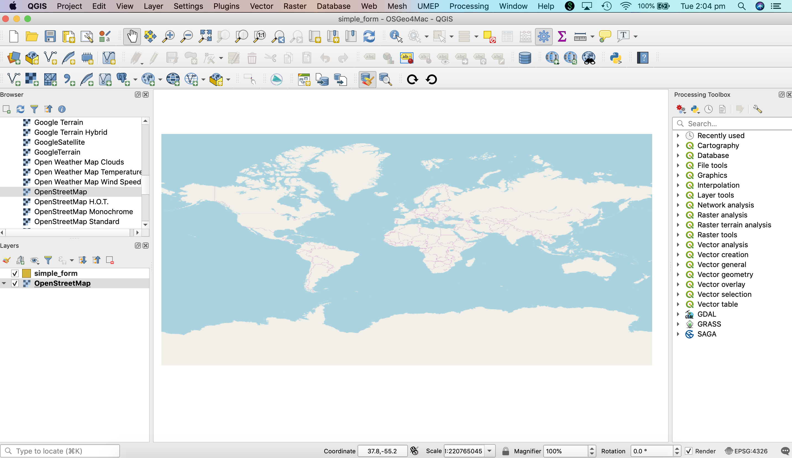
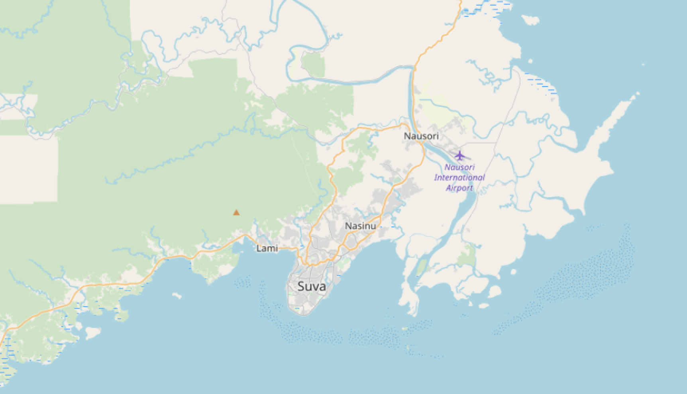
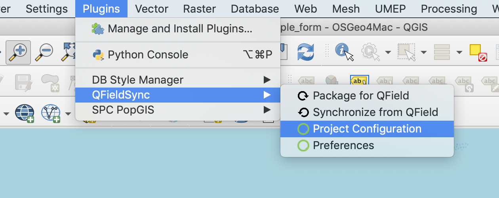
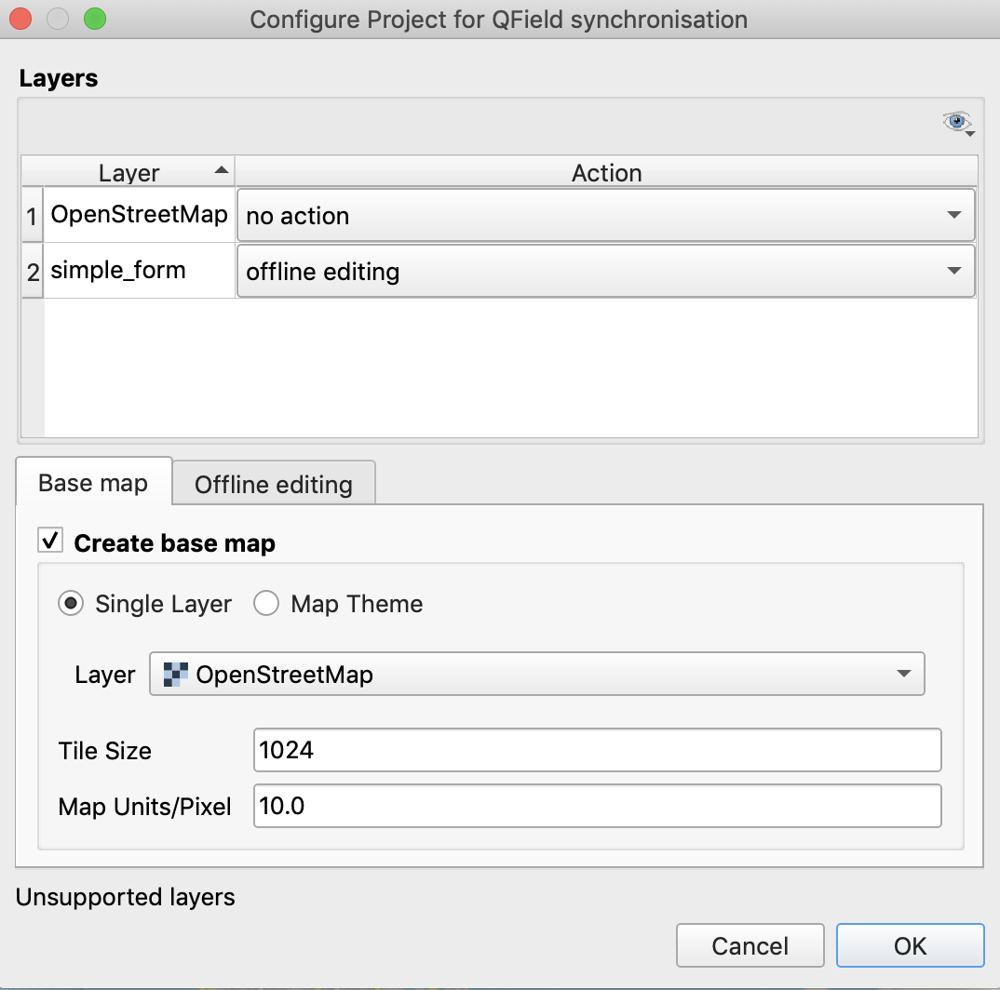
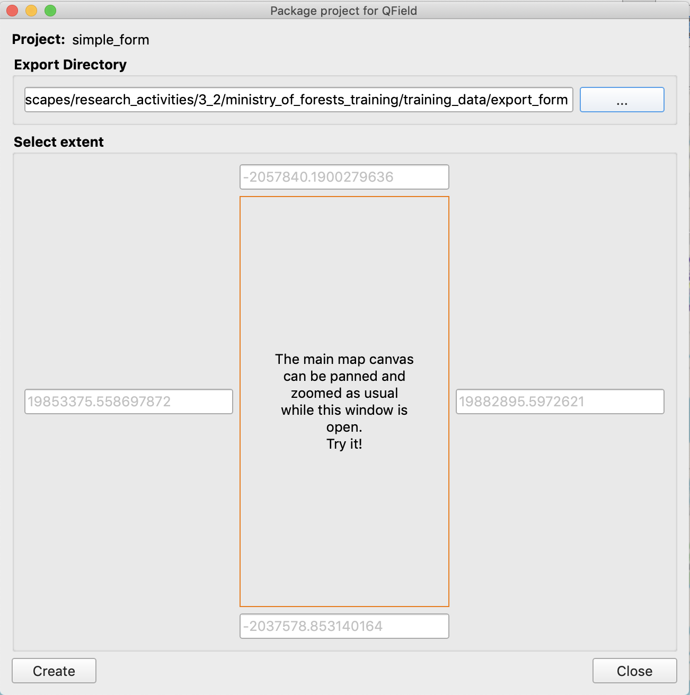
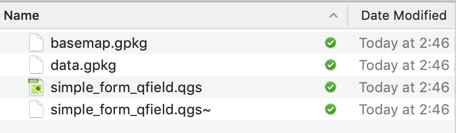
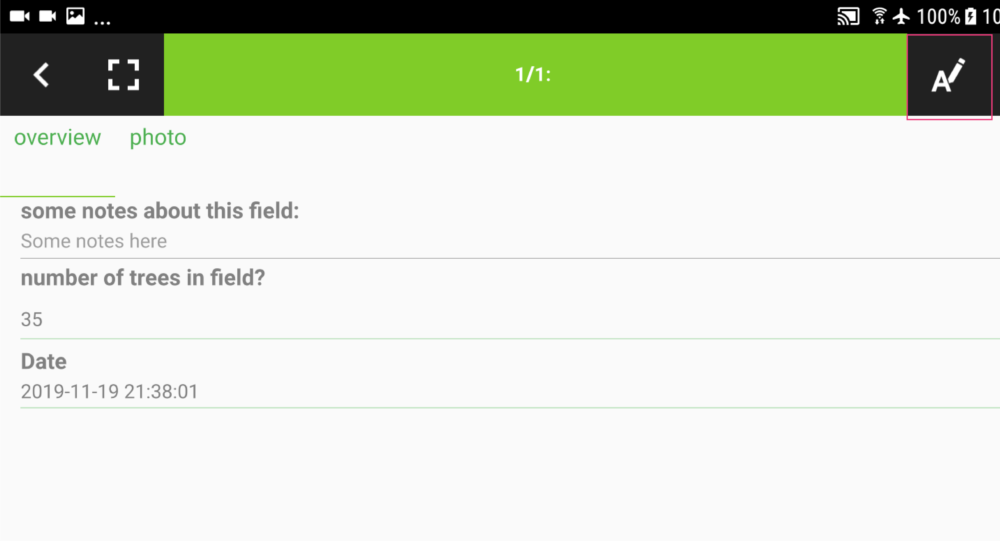
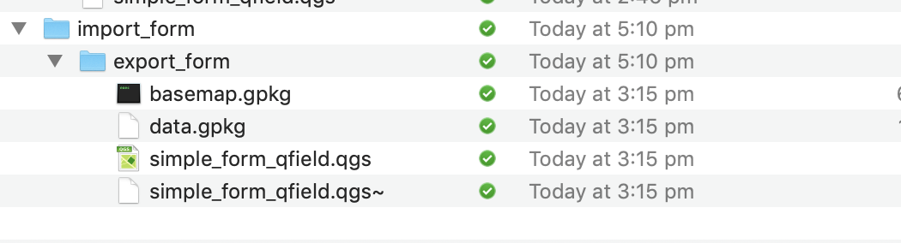
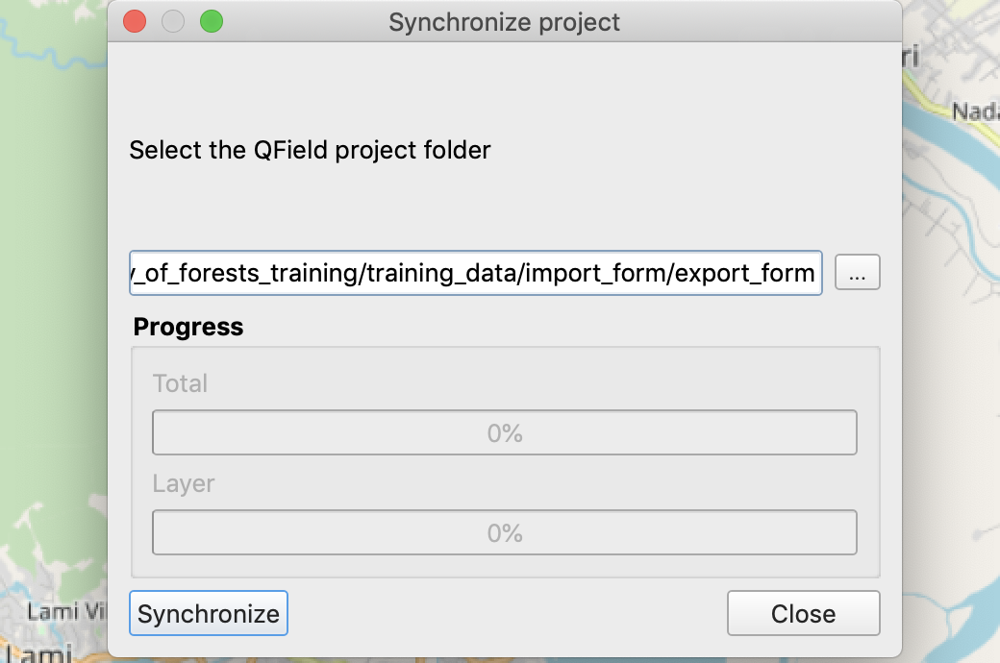

## Overview

In lesson 1 you created a geospatial dataset *simple_form.gpkg* and created a form to enter data into the attribute table for that dataset. In this lesson you will learn how to package this data for transfer to QField, how to collect data in the field using QField, and then sync field collected data back to a dataset on your desktop. 

## QField Sync Plugin

To start with you will need to open the QGIS project file *simple_form.qgs*. This will load your project into QGIS. You should check that the *QField Sync* plugin is installed.

Your QGIS screen with the *simple_form.qgs* project loaded should look like the below image.

{width=640px}

Next, you need to zoom in on Fiji or where you plan to collect data in the field. If you zoom in on Suva your *Map Canvas* should look like the image below.

{width=640px}

Save your project.

#### QFieldSync: Project Configuration

You will need to configure your project before packaging it for QField. To do this go to the *Plugins* menu then select *QFieldSync* and *Project Configuration*. Project configuration defines project characteristics relevant for collecting data in the field (i.e. configuring which layers can be edited offline or which layers to use as basemap images).

{width=640px}

Now, you need to set parameters in the *Configure Project for QField Synchronisation* widget. Set the *Action* for *simple_form* to *offline editing*. This means you can edit the form offline in QField. Next, select the *Create base map* checkbox and select *OpenStreetMap* as the basemap Layer. Then click on OK.

{width=640px}

#### QFieldSync: Package for QField

Go back to the *Plugins* menu and select *QFieldSync* and then *Package for QField*. The *Package project for QField* widget should appear. In the `...` scroll to you directory *export_form* and select this directory. Then click on *create*. This will create a copy of your project in the *export_form* directory which you can copy to your mobile device to edit in QField.

{width=640px}

If you were successful in packaging your project you should see the following files in your *export_form* directory.

{width=640px}

**Make sure you save your** ***simple_forms.qgs*** **project file at this point.**

## Move Project to Tablet

Connect your Android device to your desktop using a USB cable. Copy the *export_form* directory to your Android device's internal storage (**NOT** the SD card). If you are working on a Mac then you may need to install the [Android File Transfer](https://www.android.com/filetransfer/) application.

## QField

Open QField on your Android device. 

#### Open Project

Once QField has opened click on the menu icon in the top left of the display and then click on the cog icon and select *Open Project*. Scroll to where you copied *export_form* and select *export_form.qgs* to load the project into QField. The video below illustrates this approach.

<video width="500px" controls>
  <source src="video/open_project.mp4" type="video/mp4">
</video>

#### Browser Mode

At the top of the layers panel are two icons: a map and a pencil. Selecting the map icon means that you are in browse mode and you can visualise and query the geospatial layers loaded into your project.

<video width="500px" controls>
  <source src="video/browse_mode.mp4" type="video/mp4">
</video>

#### Digitize Mode

If you select pencil icon you now enter digitize mode. In this mode you can digitize new features and fill in the attribute form and also edit features that you have already created or came pre-loaded with your project. Note, to edit a layer you will need to make sure that layer is selected (it is highlighted grey). The following video shows how to create a polygon feature and complete the attribute form for that layer. 

<video width="500px" controls>
  <source src="video/create_feature.mp4" type="video/mp4">
</video>

#### GPS

You can manually digitize points by moving the crosshairs cursor on the *Map Canvas* and using the basemap images as a guide. However, you can also track your GPS position and add vertices for your current location. You can do this by selecting the GPS icon in the bottom right hand corner highlighted in the image below. 

{width=640px}

#### Editing Saved Features

If you are in digitize mode you can select a feature by clicking on it. You can then click on the *A* icon highlighted in pink below to edit the attribute form for the selected feature. 

{width=640px}

<video width="500px" controls>
  <source src="video/edit_features.mp4" type="video/mp4">
</video>

## Syncing with Master Dataset

Once you have collected your data in the field you need to sync it back to your master dataset.

#### Copy Data to Desktop

Copy the *export_form* directory from your Android device to the *import_form* directory on your desktop. Your *import_form* directory should look like the image below. 

{width=640px}

#### QFieldSync: Synchronize from QField

Go to the *Plugins* menu then select *QFieldSync* then select *Synchronize from QField*.

Click on the `...` icon and scroll to the *export_form* directory in the *import_form* directory. Then click on *Synchronize* and the data you collected using QField should sync with the master dataset on your computer. 

{width=640px}

You have now created a QGIS project, packaged it for QField, collected data in the field, and synced this data back to your desktop. The final lesson will cover the creation of more complex forms.

Finally, you can inspect the data you collected in QField in QGIS. Follow the process in the video below to use the *inspect features* function to query the attribute values for the data you collected in QField.

<video width="500px" controls>
  <source src="video/inspect_features.mp4" type="video/mp4">
</video>

