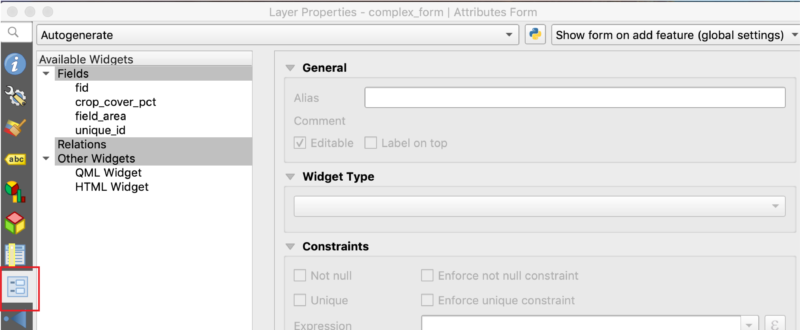
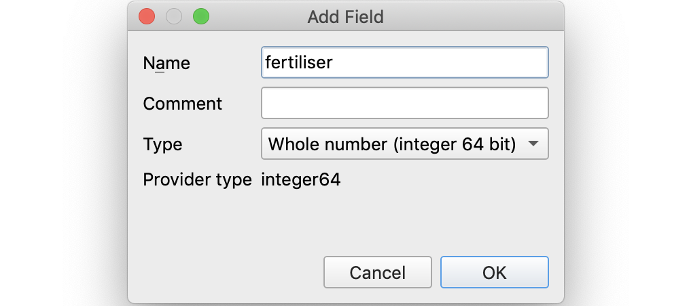

```{r setup, include=FALSE}
knitr::opts_chunk$set(echo = TRUE)
```

## Setup

#### Adding a basemap

Follow the steps in outlined in *Lesson 1* to add Open Street Maps as a basemap image. A reminder video for this process is below. Make sure that the CRS changes to EPSG: 3857 to enable quick rendering of the basemap. By default QGIS projects data *on-the-fly* so other layers will be projected to the project CRS. 

<center>

<video width="640px" controls>
  <source src="video/add_osm_basemap.mp4" type="video/mp4">
</video>

</center>

#### Creating a GeoPackage dataset

In the directory *qgis_field_training* create a new GeoPackage dataset called *complex_form.gpkg* with polygon geometry type. You can use the instructions in *Lesson 1* for the process to create a new GeoPackage dataset. As a reminder watch the video below. 

<center>

<video width="640px" controls>
  <source src="video/create_geopackage.mp4" type="video/mp4">
</video>

</center>

#### Setup Attribute Table

Follow the steps for *Field Creation* in *Lesson 1* to create the following fields: 

* a numeric field of type *integer* called *crop_cover_pct*
* a numeric field of type *real* called *field_area*
* a text field of type *text* with 60 characters called *unique_id*

Use the following screengrabs as guides. 

<center>

{width=640px}

</center>

<center>

{width=640px}

</center>

<center>

{width=640px}

</center>

We will use the *unique_id* field when we set up a one-to-many relation between two tables to allow us to collect multiple records per geometry feature. 

## Constraints

Now you have created your fields you need to create the attribute form. This process is outlined in the *Simple Form Creation* section of *Lesson 1*. Open the *complex_form* layer *Properties* and open up the *Attribute Form* widget. 

<center>

{width=640px}

</center>

Next, set up the attribute form with a *Drag and drop designer*. The under *Available Widgets* select *crop_cover_pct* so it is highlighted grey. Give this field the alias *% crop cover in field?*. When you enter data into the field in the form you will be inputting the percentage of a field covered by crops. A field cannot have more than 100 % crop coverage; therefore, you need to set a constraint to prevent a data collector accidentally entering a value more than 100. To do this go to *Constraints* then enter the expression `crop_cover_pct<=100` and give an *Expression description*: *crop cover cannot be more than 100 %* and check the checkbox *Enforce expression constraint*. By checking this checkbox you will not be able to enter data into this field unless the constraint expression is true. Here, you are preventing the form from being completed unless a number less than 100 is entered. If you try and enter a number greater than 100 the *Expression description* will appear. 

<center>

{width=640px}

</center>

There are a range of QGIS expressions that you can use to set up constraints in your form. You can find out about QGIS expressions [here](https://docs.qgis.org/3.4/en/docs/user_manual/working_with_vector/expression.html?highlight=expressions#id10). 

## Area

You also want to be able to compute the area of the field. QGIS provides a range of functions that you can use to assist with tasks such as this; you can find a list of available functions [here](https://docs.qgis.org/3.4/en/docs/user_manual/working_with_vector/expression.html?highlight=expressions#id11) and you can also create your own functions. To compute the area of a field (i.e. a polygon feature that you will have digitized using QField) you can use the `$area` function which is part of the [geometry functions](https://docs.qgis.org/3.4/en/docs/user_manual/working_with_vector/expression.html?highlight=expressions#geometry-functions).

To set up your form to compute the area select the *field_area* field in *Available Widgets* then give the field an alias *area of field?* and uncheck the *Editable* checkbox. Next, go to *Defaults* and enter `$area`. When you digitize a polygon in QField the value returned from executing the `$area` function will be assigned to *field_area*.

<center>

{width=640px}

</center>

You will notice this process is similar to how you set up the *survey_date* field in *simple_form*. In that instance you used the `$now` function to return the date-time that the feature was created in QField. 

## One-to-many relationships

You can create a one-to-many relation between two tables when you need to collect multiple records (features) for a single geometry feature. This is a useful functionality for many field data collection activities; for example, you may need to fill out a form for each crop type grown in an intercropped field while a different number of crop types are grown in different fields. Using a one-to-many relation will allow you to fill out a form for each crop type in each field and each field can have a different number of crops cultivated in it. 

This functionality is enabled in QGIS through establishing a one-to-many (*1-N*) relation between two tables. This is a database concept called [Entity Relationship Diagramming](https://docs.qgis.org/3.4/en/docs/training_manual/database_concepts/db_intro.html#entity-relationship-diagramming). You have a table (*table1*) where each feature is identified by a primary key. Multiple features in another table (*table2*) can relate to single features in *table1* through a foreign key (which takes on the relevant value of the primary key in *table1*). These concepts are explained further [here](https://docs.qgis.org/3.4/en/docs/user_manual/working_with_vector/attribute_table.html#creating-one-or-many-to-many-relations) and [here](https://docs.qgis.org/3.4/en/docs/training_manual/database_concepts/db_intro.html#constraints-primary-keys-and-foreign-keys).

To set up a one-to-many relation in QGIS you need to create a second table to relate to the attribute table of *complex_form*. To do this create a new GeoPackage layer; however, this time select the *Database* as *complex_form.gpkg* and choose the *Geometry type* as *No geometry* and the *Table name* as *many_records*. Select *Add New Layer* when the warning box appears. 

<center>

{width=640px}

</center>

Having created your table *many_records* you need to add fields to it. To do this open the layer properties and then go to the *Source Fields* tab. Add the following fields to the table. 

<center>

{width=640px}

</center>

<center>

{width=640px}

</center>

<center>

{width=640px}

</center>

#### Add Relation

Having created a foreign key and other fields in your *many_records* table you need to add the relation to the *complex_form* table. To do this go to the *Project* menu then *Properties*. In *Project Properties* select the *Relations* tab on the left-hand toolbar. 

<center>

{width=640px}

</center>

Next, you need to add the relation between the *complex_form* table and the *many_records* table. Click on *Add Relation* and fill in the form as in the image below. You can find more instructions for filling out the *Add Relation* form [here](https://docs.qgis.org/3.4/en/docs/user_manual/working_with_vector/attribute_table.html#defining-1-n-relations-relation-manager) and defining one-to-many relationships.

<center>

{width=640px}

</center>

Now you have established a one-to-many relation between features in *complex_form* and features in *many_records*. 

Finally, you need to set up the form to enter data into *many_records*. Go to the *Properties* then *Attribute Form* of *many_records*. First, setup the foreign key *fk_field* asa *Relation Reference* widget. Make sure you uncheck the *Editable* checkbox. 

<center>

{width=640px}

</center>

Next, setup the *crop_type* field as a *Value Map* widget where you can select a crop from a drop-down list and give it the alias *crop type>*. 

<center>

{width=640px}

</center>

Finally, setup the *fertiliser* field with a *Checkbox* widget.

<center>

{width=640px}

</center>

The final step in setting up a one-to-many data collection form is to add the relation to the attribute form for *complex_form*. Go to the layer properties and *Attribute Form* tab for *complex_form*. First, you need to uncheck the *Editable* checkbox for the *unique_id* field and in *Default* enter `uuid()`. Then drag the relation named *one_to_many* from *Relations* under *Available Widgets* to the *Form Layout* as in the below image.

<center>

{width=640px}

</center>

## Package for QField

You have now set up a form with constraints and a one-to-many relation. Save the project as a *.qgs* file called *complex_form.qgs* then configure the project using QField Sync. Then package the project into the directory *export_complex_form*. Make sure you set your tables to offline editing during project configuration. Copy the *export_complex_form* folder to your mobile device. 

#### One-to-many in action

Open up *complex_form.qgs* in QField. Check out the constraint set on the *crop_cover_pct* field and entering data into *many_records* using the value relation widget. If you have set up your constraint and the one-to-many relation successfully your form should function similar to the example in the video below. 

<center>

<video width="640px" controls>
  <source src="video/constraint_one_to_many.mp4" type="video/mp4">
</video>

</center>