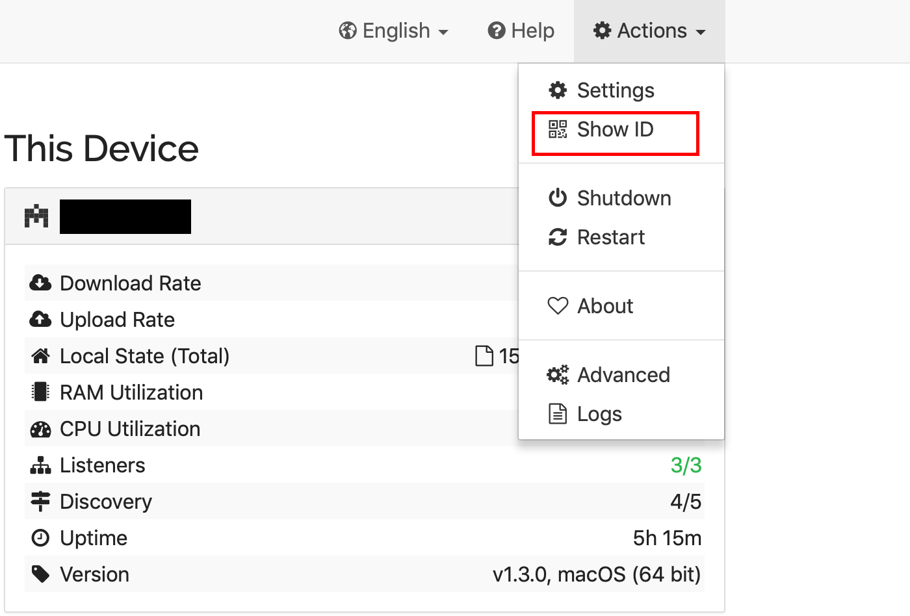

```{r setup, include=FALSE}
knitr::opts_chunk$set(echo = TRUE)
```

## Managing Remote Devices

This lesson provides instructions on how to manage QGIS data collection projects on multiple remote devices (e.g. tablets or mobile phones). This workflow enables syncing of data collected on remote devices using [QField](https://qfield.org) with a central dataset / database, updating data collection projects on remote devices, and "cleaning" data from remote devices. The application [Syncthing](https://syncthing.net) is used to share data between remote devices and a central computer.

## Syncthing

[Syncthing](https://syncthing.net) is an open source file synchronisation application. Syncthing compares a shared file on different devices (e.g. a desktop and a tablet); if a change in the file on one device is detected (e.g. a new survey has been undertaken using QField) these changes will be synced across all linked devices. Data transferred using Syncthing is secured using TLS encryption. 

There is an [FAQ](https://docs.syncthing.net/users/faq.html) for Syncthing and extensive [documentation](https://docs.syncthing.net/intro/index.html). 

### Downloading Syncthing

The Syncthing desktop application can be downloaded from the [Syncthing downloads](https://syncthing.net/downloads/) page. There are versions for Windows, MacOS, and Linux. If you are working on a Mac Syncthing can also be installed via [homebrew](https://formulae.brew.sh/formula/syncthing). The desktop application should be downloaded onto the device which will be used for central data management and syncing data collected in the field on remote devices with the central dataset / database.

The Android Syncthing application can be downloaded from [Google Play](https://play.google.com/store/apps/details?id=com.nutomic.syncthingandroid). This application should be downloaded on all remote devices which are used for data collection. When setting up Syncthing on your Android device grant it permissions to access photos, media, and files on your device.

### Configuring Devices

For Syncthing to be able sync files across two or more devices each device must be configured with the device ID of the device it is sharing with. A device ID is a unique identifier for each device that is generated when Syncthing is first started. To find your device ID go to *Actions* then *Show ID*. This will bring up your device ID and a QR code. You can share your device ID with another trusted device to enable file syncronisation. 

<center>

{width=640px}

</center>

Once you have the device ID for the device you wish to share a file with go to *Add Remote Device* and enter the device ID. To connect your desktop application (*Central* - as this will be the device that manages QGIS data collection projects across multiple remote devices) to your remote device (*Tablet 1*) go to *Add Remote Device* on your desktop application and enter the device ID of *Tablet 1*. 

<center>

{width=640px}

</center>

<center>

{width=640px}

</center>

On **Tablet 1**, when prompted, click *Add Device* to link up with *Central*. You can chose to give this device a name; here, we will call it *Central* as this will be the device that manages QGIS data collection projects across multiple remote devices. 

<center>

{width=640px}

</center>

If both your devices are correctly connected you should see each device listed under *Remote Devices*. 

<center>

{width=640px}

</center>

### Sharing Folders

There are multiple ways to share folders across devices. Here, we assume a QGIS project has been created to enable data collection using the QField mobile GIS application (see Lessons 1, 2, and 3). The QGIS project we will work with in this tutorial is called *syncthing_demo.qgs* and is in a folder named *export_syncthing_demo*. 

You can add the folder to Syncthing on the *Central* device by clicking *Add Folder*, entering the file path to the folder, and giving the folder an informative *Folder ID*. 

<center>

{width=640px}

</center>

<center>

{width=640px}

</center>


Click on the *Sharing* tab and select the remote device to share with (here it is *Tablet 1*). If you have connected your folder to Syncthing before the devices are linked you can chose to share the folder at the time the device connection is established.

<center>

{width=640px}

</center>

There are options you can set for *File Versioning*; ignore them for now. Finally, go to *Advanced* and make sure the *Watch for Changes* checkbox is ticked, the *Folder Type* is *Send and Receive*, and the *Permissions Ignore* checkbox is ticked. Click save. 

<center>

{width=640px}

</center>

Now go to your remote device (*Tablet 1*) and when prompted choose to *Add* the folder. 

<center>

{width=640px}

</center>

Go through the same process as you did on your desktop computer under the *Advanced* tab and make sure the *Watch for Changes* checkbox is ticked, the *Folder Type* is *Send and Receive*, and the *Permissions Ignore* checkbox is ticked. Click save.

<center>

{width=640px}

</center>

You should now see *syncthing_demo* listed as a folder on your remote device (*Tablet 1*). 

<center>

{width=640px}

</center>

## Collect Data Using Shared File

Open QField then *Open local project* and select *syncthing_demo*. 

<center>

<video width="500px" controls>
  <source src="video/syncthing_qfield_load_project.mp4" type="video/mp4">
</video>

</center>

Enter *edit mode* and select the *syncthing_demo* dataset and digitise some features and enter attribute values into the form. Close the QField application. 

<center>

<video width="500px" controls>
  <source src="video/syncthing_qfield_add_feature.mp4" type="video/mp4">
</video>

</center>

## Sync Data to Central Device

On your *Central* device (which has QGIS installed) go to the folder *export_syncthing_demo* and open *syncthing_demo.qgs* in QGIS. You should see the features you digitised using QField appear in the map canvas. You can also use the *QFieldSync* plugin introduced in lesson 2 to sync data collected on QGIS projects on remote devices with a central dataset. 

<center>

{width=640px}

</center>

## Cleaning data and projects on remote devices

As the QGIS project files on the *Central* device are shared with the remote devices (e.g. *Tablet 1*), you can make changes to the shared files on the *Central* device which will be updated on remote devices. For example, after you have synced the data collected using QField on *Tablet 1* with your central dataset you could delete the QGIS project and associated files in the shared folder and replace them with a *clean* QGIS project. This *clean* QGIS project could be a copy of the previous QGIS project with the same attribute table and form but without any data in the attribute table. This is useful if you have sensitive data that you wish to store on remote devices for only a short a period of time. Alternatively, you could update your data collection form and want to provide this updated form on your remote devices. 

Try deleting the QGIS project and files in the shared folder on your *Central* device and add a new QGIS project. See if this updates on your remote device *Tablet 1*. 


