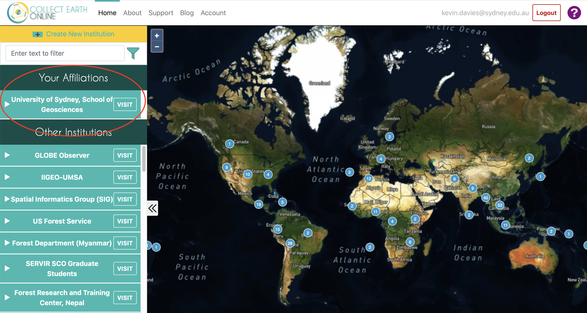
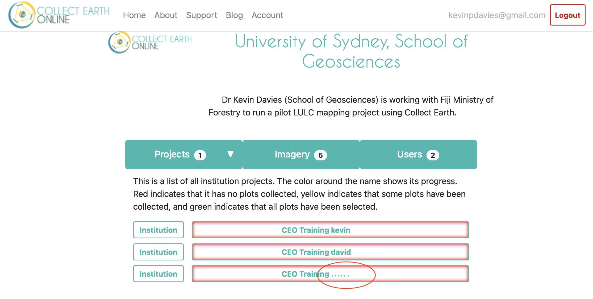
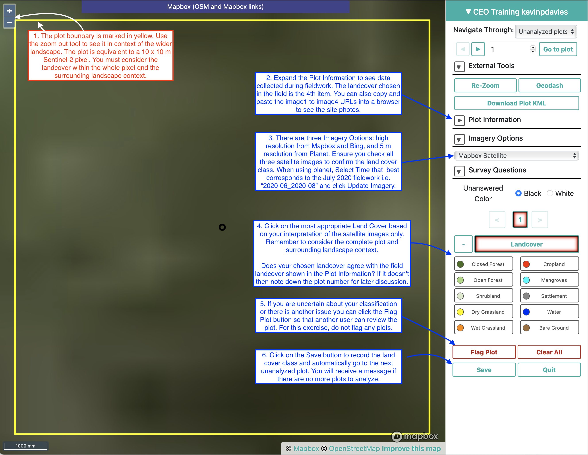

## Overview

Fiji Forestry have a need for accurate maps of land cover fin areas they manage. A pilot project is being done to co-develop a land cover mapping methodology using the geospatial tool, Google Earth Engine, and Collect Earth Online to produce 10m land cover map for a single forestry site (Nalotawa) based on Sentinel-2 satellite data. This workshop focuses on Collect Earth Online (CEO) -  a web-based, collaborative tool for collecting land cover data for map generation and accuracy assessment. 

There are two components to this training: 
- Learning CEO
- Collecting Land Cover Data

All workshop attendees must register with CEO well before the scheduled day of the workshop.

## Register with CEO

Before you can start this workshop, you will need to register with Collect Earth Online:

1. Open your web browser and go to https://collect.earth
2. Click the **Login/Register** button in the top right of the page
3. Click the **Register** button
4. Enter your preferred email address and choose a password. You can untick the **Subscribe to Mailinglist** if you prefer. Click the **Register** button. 
5. You will now be at the main page of Collect Earth Online. Click the **Logout** button on the top of the page.
6. You should receive a message: **You have successfully created an account**. You will also receive a confirmation email.
7. **IMPORTANT:** Let your instructor know the the email address you used to register with Collect Earth Online **BEFORE** the workshop. Your instructor will need to assign you to the **University of Sydney, School of Geosciences** organisation in CEO so you can complete the workshop. You will receive another email when your instructor havs completed this step.

## Suggested Schedule

- 09:00 Introduction
- 09:15 Learning CEO
- 10:15 Break
- 10:30 Collecting Land Cover Data
- 12:00 Review and Discussion
- 12:30 Finish

## Learning CEO

On 14th and 15th July 2020, a field team from Ministry of Forestry and USP labelled land cover plots in the Nalotawa Forestry area. The land cover classes used by the field team are shown below (at Level 2):

| Level 1       | Level 2       | Code | Definition  |
| ------------- | ------------- | ---- | ----------- |
| Forest        | Closed Forest | 1    | Tree > 40% cover |
|               | Open Forest   | 2    | Tree < 40% cover |
| Shrubland     | Shrubland     | 3    | |
| Grassland     | Dry Grassland | 4    | May include herbs/shrubs. Tree canopy < 10% cover.|
|               | Wet Grassland | 5    | May include herbs/shrubs. Tree canopy < 10% cover.|
| Cropland      | Cropland      | 6    | Area >= 50% covered by agriculture |
| Wetland       | Mangroves     | 7    | Area >= 30% covered in mangroves |
| Settlement    | Settlement    | 8    | Area >= 30% developed land including houses, roads |
| Other Lands   | Water         | 9    | Water |
|               | Bare Ground   | 10   | Bare soil/rock |

The objective of this exercise is to learn how to label these same plots using Collect Earth Online (CEO). You will be using the provided satellite images in CEO to decide which land cover is present. You will then compare your land cover label with the class assigned to the same plot during the fieldwork. At the end of this exercise, your instructor will lead a short discussion on the results and your experience with CEO.

1. Open your web browser and go to https://collect.earth
2. Click the **Login/Register** button in the top right of the page
3. Enter the email address and password you used to register with CEO.
4. You should now be at the home page of CEO. The map shows the locations of institutions using CEO.
5. Check that the **University of Sydney, School of Geosciences** is listed under **Your Affiliations** (circled in red in Fig. 1). If you see **No Affiliations Found...** then you will need to speak to your instructor to have you added before you can continue.

 

{width=100%} 

 

6. Click the **VISIT** button next to the **University of Sydney, School of Geosciences**.
7. You will see a list of projects that you have access to. Find the project which ends with your name or email and click on it (see Fig. 2 below). If you do not see your name or email after any projects then speak with your instructor before continuing with the training.

 

{width=80%} 

 

8. Your project should now open. Carefully read through the captions on Fig. 3 below to understand the various elements. After you have completed this, continue to step 9.

 

{width=95%}

 

9. Ensure you have **Unanalyzed plots** chosen and click the **Go to first plot** button.

10. The instuctor will now demonstrate the various steps to label a plot. Follow along and use Fig. 4 below as a reference.

 

{width=95%}

 

11. Keep labelling as many plots as you can in the time remaining. Make sure you note down the plot ID where your chosen landcover class does not match the landcover class assigned during the fieldwork. 

Your instructor will lead a discussion on some example plots where the particpant's land cover class did not agree with the land cover class assigned during the fieldwork. Remember, there is not necessarily a correct answer, so it is important to discuss these ambiguities and why they occur. This will help you use your existing knowledge of the area to improve your image interpretation skills.

## Collecting Land Cover Data

You will use your CEO skills to label new plots for the Nalotawa forestry site. The labels you assign in this exercise will be used to produce a pilot land cover map for this area. All participants will be labelling unique plots in the same project which demonstrates the collaborative nature of CEO.

1. Log into CEO if you aren't already logged in (https://collect.earth)
2. Click **Home** in the main menu.
3. Click **VISIT** next to **University of Sydney, School of Geosciences** under **Your Affiliations** 
4. Open the project called **CEO Nalotawa Training**. If you don't see this project then speak with your instructor.
5. Start labelling plots as you learnt in the previous exercise. Please use your knowledge and experience when choosing a land cover label, but if you are unsure of a class then you can click the **Flag Plot** button. **IMPORTANT** make sure you click **Save** at the bottom after assigning a class or flagging a plot to automatically move to the next plot. If you do not click Save, your choice will be lost.

One the group has finished the exercise, you instructor will download the labelled data and demonstrate how the  land cover map can be produced in Google Earth Engine.

<footer>

</footer>
