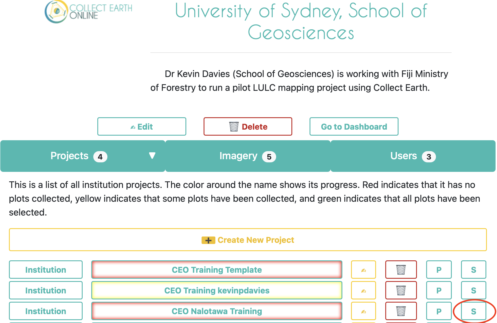
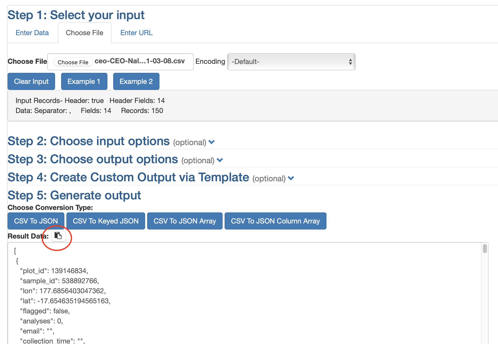

## Overview

Fiji Forestry have a need for accurate maps of land cover fin areas they manage. A pilot project is being done to co-develop a land cover mapping methodology using the geospatial tool, Google Earth Engine (GEE), and Collect Earth Online (CEO) to produce 10m land cover map for a single forestry site (Nalotawa) based on Sentinel-2 satellite data. This exercise focuses on the final LULC map generation in GEE. 

Note: You will need to have **Admin** access to the **University of Sydney, School of Geosciences** organisation in Collect Earth Online in order to complete this exercise.

There are two components to these instructions: 

- Downloading Plot Data (CEO)

- Map Generation (GEE)

## Downloading Plot Data

1. Open your web browser and go to https://collect.earth
2. Click the **Login/Register** button in the top right of the page
3. Enter the email address and password you used to register with CEO.
4. You should now be at the home page of CEO.
5. Click on **University of Sydney, School of Geosciences** under **Your Affiliations**.
6. Find the **CEO Nalotawa Training** project and click the **S** button to the right of the project (circled in red in Fig. 1). This will download the plot data csv file. If you do not have this button then you do not have Admin rights. The file will be named **ceo-CEO-Nalotawa-Training-sample-data-2021-03-08.csv** (the date will be different)

{width=95%}

7. In your browser go to https://www.convertcsv.com/csv-to-json.htm
8. In **Step 1: Select your input** click the **Choose File** tab, then click the **Choose File** button. Select the downloaded plot CSV file from step 6.
9. Scroll down to **Step 5: Generate output** and click the **Copy Result to Clipboard** button circled in red in Fig. 2 below.

{width=95%}

## Map Generation

1. Open your web browser and go to https://kevinpdavies.users.earthengine.app/view/fiji-lulc-map
2. Select the ERPD Region as **Nalotawa**. The map should zoom to this area.
3. Paste the JSON text from the previous section into the text box. Press the *Tab* key on your keyboard to validate the input. You should see the total number of valid samples displayed.
4. Click the **Create LULC** button to generate the map. 
5. When the map is ready a **Download Ready** link will appear. Click on it and wait for the download - this can take some time to process so do not close the browser.
6. The downloaded file can be styled in a desktop GIS such QGIS.

<footer>

</footer>
