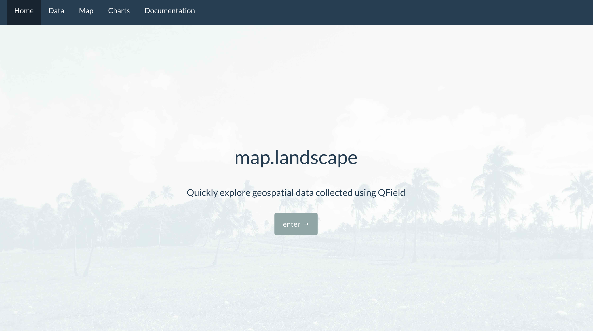
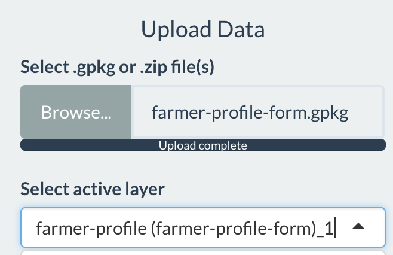
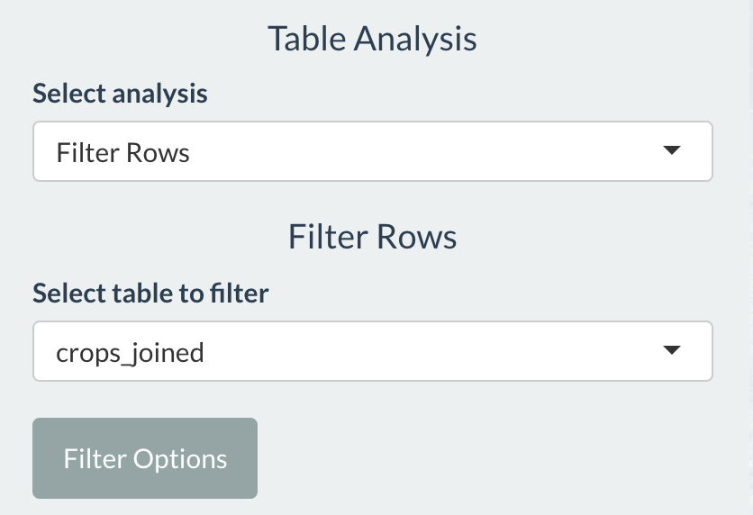
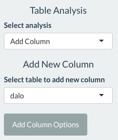

```{r setup, include=FALSE}
knitr::opts_chunk$set(echo = TRUE)
```

## Introduction

A dashboard application to explore geospatial data using interactive tables, web maps, and charts.

Use map.landscape was to quickly explore and sync data collected using <a href="https://qfield.org" target="_blank">QField</a> mobile GIS. 

* Sync data collected using QField on different mobile devices.
* Upload spatial and non-spatial tabular data as GeoPackage or zip files.
* Explore data in interactive tables (using <a href="https://rstudio.github.io/DT/" target="_blank">DataTables</a>).
* Combine tabular data using spatial and non-spatial joins.
* Create summary tables.
* Create and style web maps (using <a href="https://rstudio.github.io/leaflet/" target="_blank">Leaflet</a>).
* Visualise data using different charts (using <a href="https://ggplot2.tidyverse.org" target="_blank">ggplot2</a>).

## Overview

This tutorial is a demo of analysing data using the map.landscape dashboard.*Fake* test data generated using the Fiji Government's Ministry of Agriculture *farmer profile form* is used here. This tutorial will introduce a workflow to explore and visualise data related to dalo production on subsistence, semi-subsistence, and commercial farms.  

It will demonstrate:

* combining geographic location and outline of fields with tables storing information about cropping practices
* extracting fields where dalo cultivation occurs
* computing the area under dalo cultivation in each field
* creating a bar chart showing the area of dalo on commercial, semi-subsistence, and subsistence farms
* visualising dalo cultivation on a web map

## Links

**map.landscape dashboard** - <a href="https://livelihoods-landscape.shinyapps.io/maplandscape/" target="_blank">map.livelihoods-and-lanscapes.com</a> 

**training data for this tutorial** - <a href="https://storage.googleapis.com/fiji-dashboard-training/farmer-profile-form.gpkg" target="_blank">download here</a>

data submission and download - <a href="https://fiji-ag-dot-aciarlal1.ts.r.appspot.com/" target="_blank">training.livelihoods-and-landscapes.com</a>

## Quick Tour

Tabs in the navbar to move between the Data (table), Map, and Chart analysis pages. 

**Data**: upload data and perform analysis on data tables.
**Map**: visualise data on a web map.
**Chart**: visualise data using histograms, bar plots, and scatter charts.

<br>
<center>
{width=75%}
</center>
<br>

## Upload Data

Download the data for the tutorial here <a href="https://storage.googleapis.com/fiji-dashboard-training/farmer-profile-form.gpkg" target="_blank">here</a>.

Go to <a href="https://livelihoods-landscape.shinyapps.io/maplandscape/" target="_blank">map.landscape dashboard</a>.

Follow these operations to load the *farmer-profile-form.gpkg* data into the dashboard:

1. Select *Browse...* under **Upload Data**.
2. Move to the directory where you downloaded the *farmer-profile-form* data.
3. Select *farmer-profile-form.gpkg*.

The file should start loading into the dashboard. Once complete you should see a list of tables that are stored in the GeoPackage file under the **Select active layer** drop down list. 

<br>
<center>
{width=50%}
</center>
<br>

Before doing any analysis of dalo cultivation, explore the data on the map interface.

Click on the **Map** tab.

Click the **Map controls** check box to bring up the options to style your web map. To quickly explore the data we'll make a map of the fields surveyed using the *farmer profile form* and represent the area of each field using a colour scale. 

Style your web map:

1. In the **Select active layer** drop down selector choose the layer *farmer-profile (farmer-profile-form)_1*.
2. In the **Select variable** drop down selector choose *area*. This variable represents the area of the field in square metres. 
3. Choose a **Fill colour palette** such as *red-yellow-green* - with this colour palette fields with a smaller area will be rendered in red shades and fields with larger areas will be rendered in green shades. 
4. Click **draw map** and the fields should render on your web map. 

<br>
<center>
{width=90%}
</center>
<br> 

## Tables

### Attach crops information to each field

Click on the **Data** tab.

Use the **Select active layer** selector to click on the <em>farmer-profile (farmer-profile-form)_1</em> and <em>crops (farmer-profile-form)_3</em> tables. Explore these tables in the interactive table interface.

The <em>farmer-profile (farmer-profile-form)_1</em> is a spatial table which includes geographic information (shape and location) for each field surveyed (you just saw this on the web map). Each field is uniquely identified by a value in the column *farm_id*. There are other columns in this table which describe farm attributes such as *type_of_farmer* which tells us if this field is part of a subsistence, semi-subsistence, or commercial farm. 

The <em>crops (farmer-profile-form)_3</em> is a non-spatial table (like an Excel spreadsheet). Each column in this table stores a variable describing some attribute about crop cultivation. There is a column *crop_id*; the value in this column relates each crop observation to a field. This tells us which crops are grown in each field.  

We can use matches between the *farm_id* and the *crop_id* to attach the crops information to each field. This will allow us to make maps of dalo cultivation and summarise dalo cultivation across different types of farmer. 

Under **Table Analysis** and the **Select analysis** selector choose **Combine Tables**.

Fill out the **Combine Tables** options:

* **Select left table in join**: <em>farmer-profile (farmer-profile-form)_1</em>
* **Select right table in join**: <em>crops (farmer-profile-form)_3</em>
* **Select primary key(s) - left table**: *farm_id*
* **Select foreign key(s) - right table**: *crop_id*
* **Join Type**: *column - inner*
* **Table name**: give your table an informative name - (e.g. *crops_joined*)
* Click **Join**

<br>
<center>
{width=35%}
</center>
<br> 

Click on the **Select active layer** selector and check that the table you just created by combining the <em>farmer-profile (farmer-profile-form)_1</em> and <em>crops (farmer-profile-form)_3</em> tables is listed. 
### Extract dalo cropping

Next, we need to create a table that contains only the information related to dalo cultivation. We can do this by filtering values in a table based on values in one or more columns. 

Under **Table Analysis** select **Filter Rows**.

Select the table you just created by combining <em>farmer-profile (farmer-profile-form)_1</em> and <em>crops (farmer-profile-form)_3</em>.

<br>
<center>
{width=50%}
</center>
<br> 

Click **Filter Options** and a popup window will appear.

In **Conditions to filter rows** add `crop == 'dalo'` and in **Table name** enter *dalo*.

Click **Filter**.

<br>
<center>
{width=50%} 
</center>
<br> 

Click on the **Select active layer** selector and check that the *dalo* table you just created is listed.

### Calculate area of dalo cultivation

Next, we will calculate the area of dalo cultivation in each field. The <em>dalo</em> table has an *area.x* column which records the area of the field (computed by QField) and an *area.y* column which records the percentage of a field under dalo cultivation. We can combine values in these two columns to calculate the area of dalo in square metres in a new column. 

Under **Table Analysis** select **Add Column**.

In the **Select table to add new column** selector choose the *dalo* table. 

Click **Add Column Options**

<br>
<center>
{width=50%}
</center>
<br> 

In the popup window, enter *the following into <em>dalo_area</em> into the **New column name** and `area.x * (area.y / 100)` into **Function to add new column**. 

Click **Create column**. 

<br>
<center>
{width=50%}
</center>
<br>

Click on the **Select active layer** selector and check that the *dalo* table you just created is listed. Select the *dalo* table and scroll to the far right to see if a *dalo_area* column has been created.

## Charts

We have now identified all fields where dalo was cultivated and computed the area of dalo cultivation in these fields. 

Next, we will use map.landscapes chart options to create a bar plot showing the area of dalo cultivation on commercial, semi-subsistence, and subsistence farms. 

Click on the **Charts** tab in the navbar. 

Set the following chart options:

* In the **Select active layer** selector select *dalo*
* In the **Chart type** selector select *bar plot*
* In the **Grouping variable** selector select *type of farmer*
* In the **Summary variable** selector select *dalo_area*
* In the **Bar plot type** checkbox select *sum*
* Click the **draw chart** button

Here, we are creating a bar plot which visualises amounts or quantities in different categories / groups. The categories are selected in the **Grouping variable** selector and here we are using type of farmer (commercial, semi-subsistence, and subsistence) as a category. The variable to summarise in each group is specified in the **Summary variable** selector; here we are summarising the area of dalo cultivation on different types of farms. 

<br>
<center>
{width=50%}
</center>
<br>

You should see a chart similar to the image below appear in your display. 

<br>
<center>
{width=75%}
</center>
<br>

## Maps 

We can also visualise dalo cultivation on a web map. Click on the **Map** tab in the navbar. 

Click the **Map controls** checkbox and set the following options to create a map of the area of dalo cultivation in each field.

* In the **Select active layer** selector choose the *dalo* table
* In the **Select variable** selector choose *dalo area*
* In the **Fill colour palette** selector choose *red-blue*
* Click **draw map**

<br>
<center>
{width=50%}
</center>
<br>

You should see a map similar to the below image render on your display. You can check the **Legend** checkbox in the **Map controls** to bring up a legend for your map. 

<br>
<center>
{width=90%}
</center>
<br>

<div class="tocify-extend-page" data-unique="tocify-extend-page" style="height: 0;"></div>
<footer>
<p><hr></p>
</footer>

