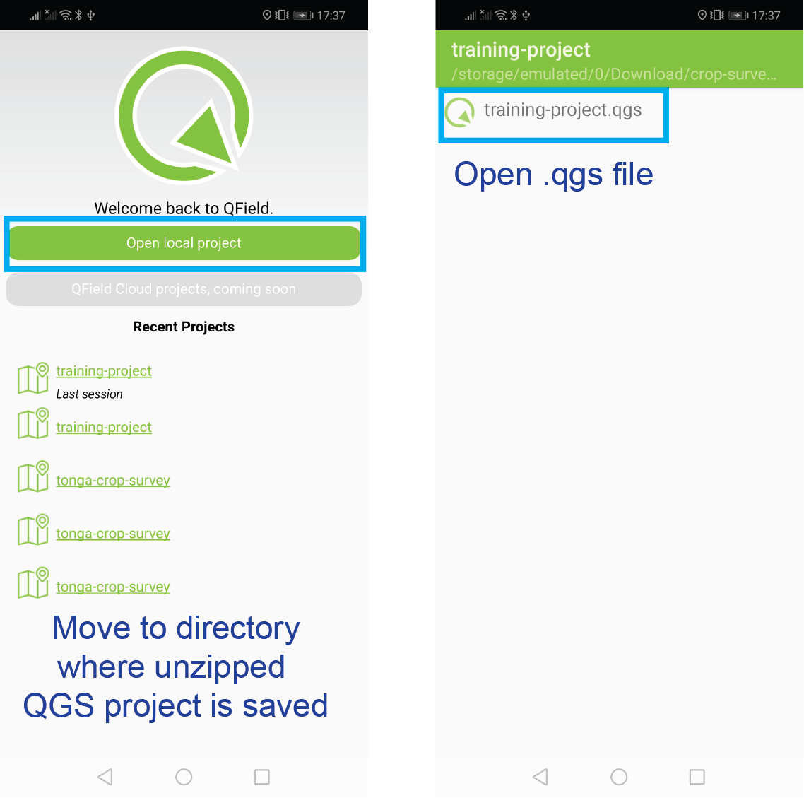
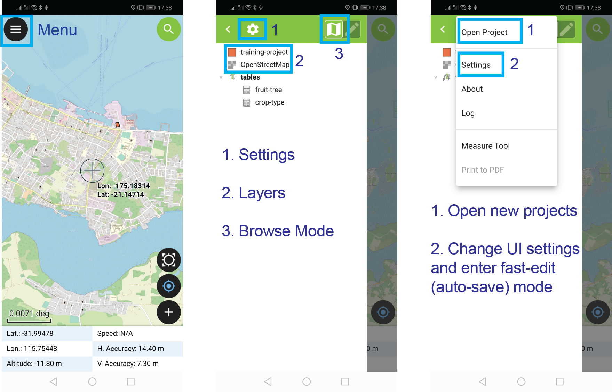
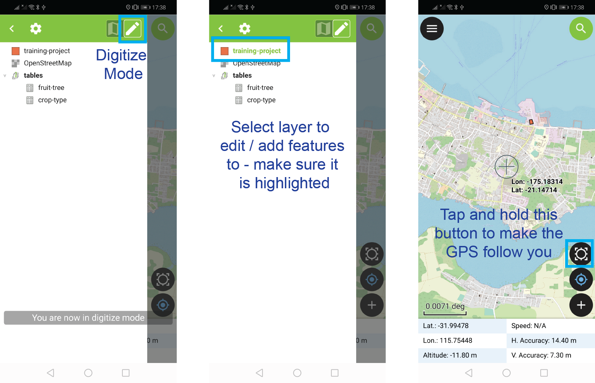
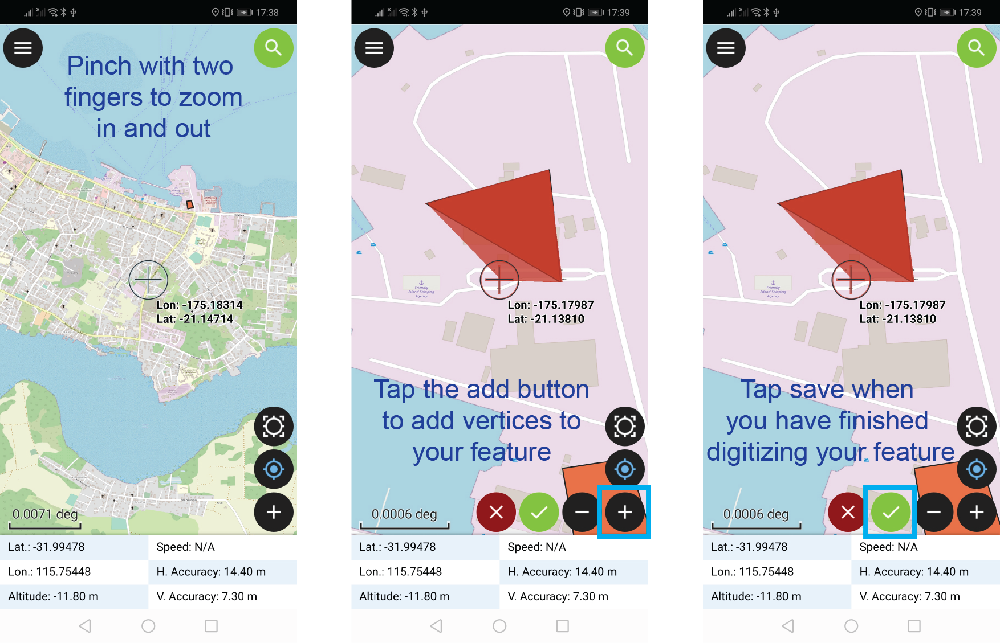

## Overview

Use QField for mapping farms and completing crop surveys.

 
<em>
Bookmark <a href="https://tonga-crop-survey.com" target="_blank">www.tonga-crop-survey.com</a> in Google Chrome!
</em>

<iframe data-autoplay src="https://player.vimeo.com/video/427286693" frameborder="0" allow="autoplay; fullscreen" allowfullscreen></iframe>

## QField

 

<ul>
  <li><a href="https://qfield.org/docs/index.html#" target="_blank">QField</a> is an open source mobile GIS</li> 
  <li>QField is based on <a href="https://qgis.org/en/site/" target="_blank">QGIS</a></li> 
  <li>Map landscape features</li> 
  <li>Collect attribute information</li> 
  <li>Maps and forms</li>
</ul> 

## QField and Crop Surveys

 

Fast data capture, more information, better decisions!

 

## QField in Action - Fiji and Tonga

 

## Training Objectives

 

<ul>
  <li>Open QField on a mobile device </li>
  <li>Open a QGS project in QField </li>
  <li>Map a landscape feature using QField </li>
  <li>Complete a form </li>
  <li>Submit a completed a form </li>
</ul>

## Schedule - Next Two Weeks

 

<ul>
  <li>25th September - Introduction to QField </li> 
  <li>28th September - Introduction to crop survey form </li>
  <li>29th September - 12th October - Crop survey fieldwork </li>
  <li><a href="https://docs.google.com/document/d/e/2PACX-1vSuVSTnQWwlGESH7tvRpMsSR2I8hOqCDkSsm5lr8ZNBdmZCIL4SlYw3cJMAF0jSUjLsoVJuS2lk4P0Q/pub" target="_blank">Details and logistics</a> </li>
</ul>

## Schedule - Today

 

<ul>
  <li>13:30 - 14:00 - Introductions </li> 
  <li>14:00 - 15:00 - Classroom activity - Complete a form using QField </li>
  <li>15:15 - 16:00 - Practical activity - Map a feature outside </li>
  <li>16:10 - Feedback and plans for Monday </li>
  <li><a href="https://docs.google.com/document/d/e/2PACX-1vSuVSTnQWwlGESH7tvRpMsSR2I8hOqCDkSsm5lr8ZNBdmZCIL4SlYw3cJMAF0jSUjLsoVJuS2lk4P0Q/pub" target="_blank">Details and logistics</a> </li>
</ul>

## Data Management

 

<b>Data Owners:</b> Ministry of Agriculture, Food, Forests, and Fisheries (MAFF). 

<b>Data Access:</b> Restricted to MAFF staff. Do not share data with people from other organisations except with written permission of MAFF CEO. Raw data cannot be modified.

<a href="https://docs.google.com/document/d/e/2PACX-1vSjjfWT2VXZUAenWQFlpSOSK2JkWhJzeW-mPh5Hd7MAYMPHO0RcmsojylDs4B-tX-4lwcUGD5lUANNa/pub" target="_blank">More information here.</a>

<b>Your Responsibilities:</b>

<ul>
  <small><li>Delete data from mobile devices once it has been submitted and you have been instructed to </li></small>
  <small><li>Do not disclose data to any third parties without relevant permissions </li></small>
  <small><li>Do not alter data except to correct data entry errors prior to submission </li></small>
  <small><li>If you are using a MAFF / ACIAR project laptop ensure it is kept secure and NOT used for personal use - this is to keep data secure </li></small>
</ul>

## Data Management

 
<em>
Bookmark <a href="https://tonga-crop-survey.com" target="_blank">www.tonga-crop-survey.com</a> in Google Chrome!
</em>
 
<ol>
  <li>Download QGS project from <a href="https://tonga-crop-survey.com" target="_blank">www.tonga-crop-survey.com</a> to your mobile device</li>
  <li>Open QGS project in QField and collect data.</li>
  <li><b>Every day</b> submit completed forms to <a href="https://tonga-crop-survey.com" target="_blank">www.tonga-crop-survey.com</a></li>
  <li>At the end of fieldwork delete QGS projects on your mobile device</li>
</ol>

 

## Feedback

 

Please provide any feedback on your experience using QField for crop surveys.
 

We can use it to improve the tool.
 

 

<em>

UWA ethics: Any comments you provide will be recorded anonymously and will not be disclosed outside the development team (<a href="https://livelihoods-and-landscapes.github.io/info-sheet/" target="_blank">more here - information sheet</a>).

</em>

## Download Training Project

Download a training project from <a href="https://tonga-crop-survey.com" target="_blank">www.tonga-crop-survey.com</a>

## Download Training Project

 

<iframe data-autoplay class="r-stretch" src="https://player.vimeo.com/video/460490513" frameborder="0" allow="autoplay; fullscreen" allowfullscreen></iframe>

## Download Training Project

Unzip the training QGS project. Select <b>crop-survey-forms.zip</b> &rarr; unzip / extract to.

<iframe data-autoplay class="r-stretch" src="https://player.vimeo.com/video/460500687" frameborder="0" allow="autoplay; fullscreen" allowfullscreen></iframe>

## Open QField

Download <a href="https://qfield.org/docs/index.html#" target="_blank">QField</a> from the Google Play Store. Look for this icon to open the app:

 

## Open Training Project

 

## QField Interface

 

## Digitize Mode

 

## Map a Landscape Feature

 

## Complete a Form

 

## Map a Feature and Complete Form

 

<iframe data-autoplay class="r-stretch" src="https://player.vimeo.com/video/460842680" frameborder="0" allow="autoplay; fullscreen" allowfullscreen></iframe>

## Continue Mapping and Useful Tips

 

## Submit Completed Form

 

## Edit Features

 

<iframe data-autoplay class="r-stretch" src="https://player.vimeo.com/video/460837789" frameborder="0" allow="autoplay; fullscreen" allowfullscreen></iframe>

## Test in the Field

 

<ul>
  <li>Test outside - walk around a feature to map it </li>
  <li>Remember to check the crosshairs to so the map follows your GPS location </li>
  <li>Submit your data at <a href="https://tonga-crop-survey.com" target="_blank">www.tonga-crop-survey.com</a>
</ul>

Useful Links:

<ul>
  <li><a href="https://qfield.org/docs/index.html" target="_blank">QField Documentation</a> </li>
  <li><a href="https://livelihoods-and-landscapes.github.io/qgis_qfield_tutorials/training_overview.html" target="_blank">Livelihoods and Landscapes - QField and QGIS training</a></li>
</ul>

