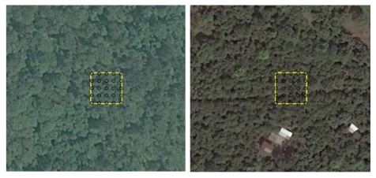
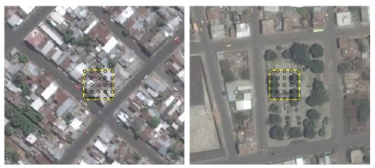
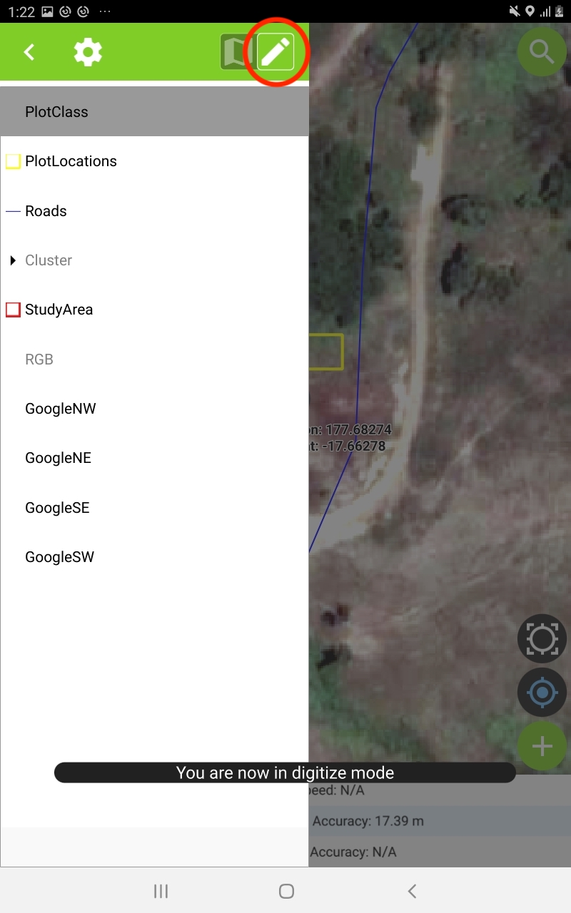
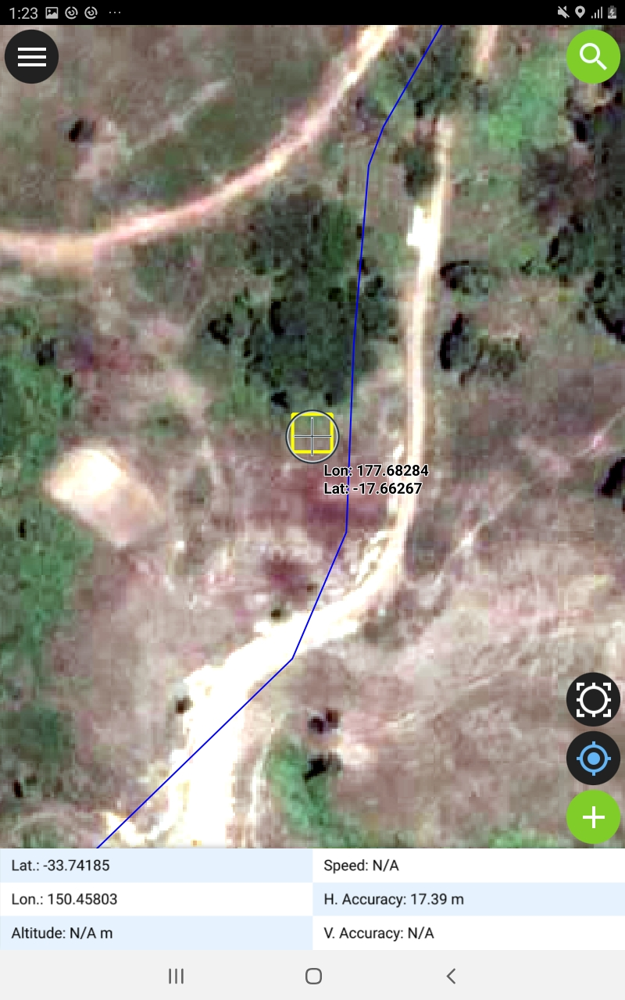
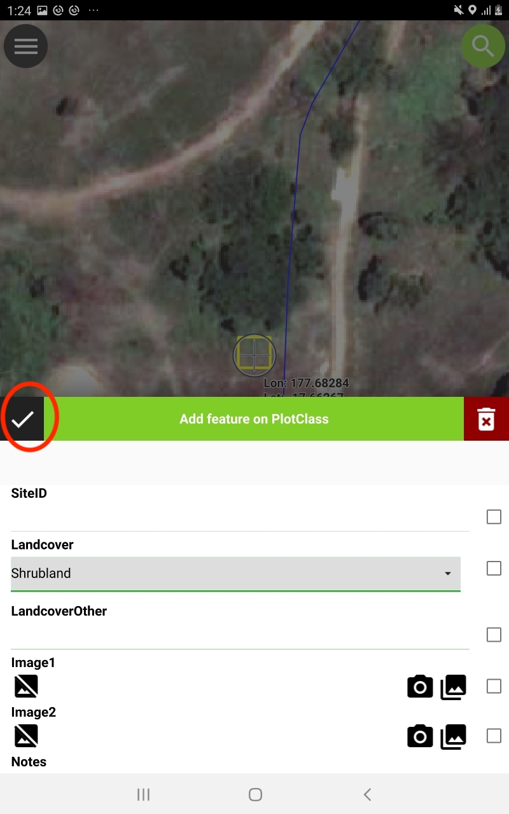
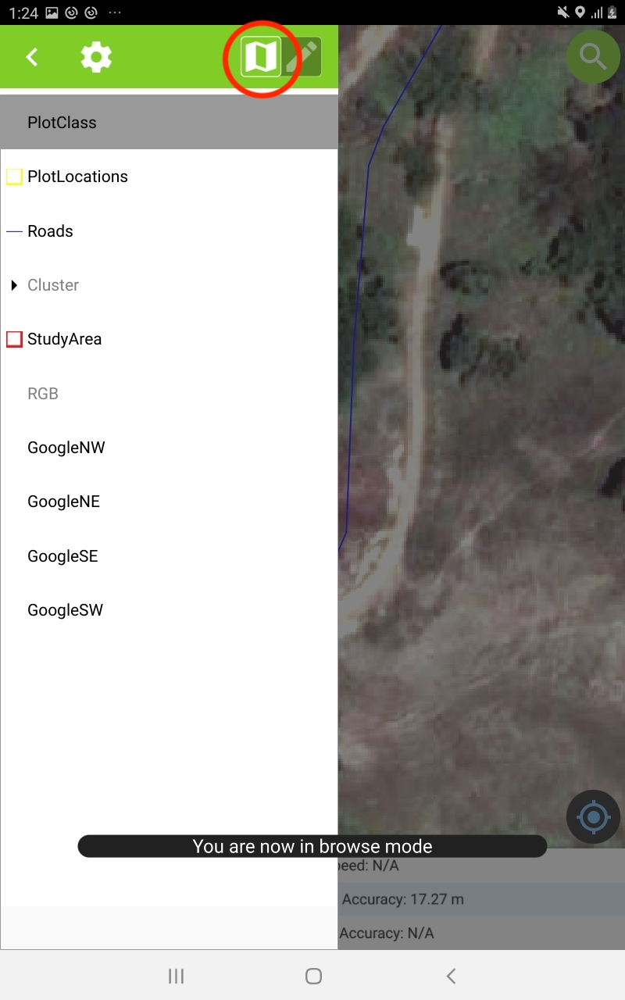

## Overview

Fiji Forestry have a need for accurate maps of forest landcover for REDD+ reporting. A pilot project is underway to co-develop a landcover mapping methodology using the geospatial tool and Google Earth Engine to produce 10m landcover map for a single ERPD site based on Sentinel-2 satellite data. This use case training page is to be used as a guide for the pilot field site visit to Nalotawa ERPD site to take place on July 13 - 16, 2020.

The draft landcover methdology for Forestry is largely based on the OpenForis Collect Earth Project Development Manual. The draft methodology we will use to guide the development of the pilot landcover map can be summarised by the following steps:

1. Initial project planning
2. Define the LULC classification system
3. Image requirements and aquisition
4. Create a set of LULC keys to aid in image interpretation
5. Response and sample design for image interpretation
6. Training of image interpreters 
7. Data collection via image interpretation
8. LULC map prodcution in Google Earth Engine
9. Accuracy assessment
10. Pilot project review

To date, steps 1 - 3 have been addressed at a preliminary level, and they may need to be revisited. The focus of the field site visit is steps 2 and 4.

The two objectives are:

1. Refine and verify the LULC classification system in the field (step 2).
2. Collect field data to aid in the creation of a set of LULC keys to aid in image interpretation (step 4).

## Objective 1 - Refine and Verify LULC Classes

The following is the LULC classes are currently defined for the field work:

---

| Level 1       | Level 2       | Definition  |
| ------------- |---------------| ------------|
| Forest        | Closed Forest | Tree > 40% cover |
|               | Open Forest   | Tree < 40% cover |
| Shrubland     | Shrubland     |
| Grassland     | Dry Grassland | May include herbs/shrubs. Tree canopy < 10% cover.|
|               | Wet Grassland | May include herbs/shrubs. Tree canopy < 10% cover.|
| Cropland      | Cropland      | Area >= 50% covered by agriculture |
| Wetland       | Mangroves     | Area >= 30% covered in mangroves |
| Settlement    | Settlement    | Area >= 30% developed land including houses, roads |
| Other Lands   | Water         | Water |
|               | Bare Ground   | Bare soil/rock |
|               | Other         | Any area that does not fall into the other Level 2 classes |

---

Although this set of classes has been defined, these should be actively reviewed, criticised and validated while in the field. The following questions may help:

- Is the class heirarchy defined correctly?
- Are the class definitions correct?
- Is the set of Level 2 classes exhaustive and unambiguous (i.e. all landcover types can be classified as one and only one of the classes)?
- Does the set of LULC classes meet all your requirements (i.e. REDD+ reporting, other)?

An important outcome of the fieldwork will be to improve and refine the above LULC class definition table.

## Background - Image Interpretation Keys

Image interpretation keys provide an analyst with a visual example and a corresponding set of rules for classifiying a sample plot. We will use some examples from Ecuador taken from the OpenForis project manual to briefly introduce interpretation keys.

The interpetation keys in Figure 1 are examples used to guide primary (left) and secondary (right) forest classifications. The yellow boundary represents the sample plot that has been labelled as primary (or secondary) forest. This plot usually corresponds to a single pixel in a more coarse satellite image that will be used to produce the final landcover map. Inside the yellow boundary are 25 black points that are used to help guide the analyst in interpreting percentage cover of a class within a plot. 

{width=80%} 

Figure 2 shows two two keys for the urban class. The left-hand key is straightfoward guide. The right-hand key is used to demonstrate that if the plot were classified in isolation it would be forest, however, given the surrounding urban context, this key represents a class of urban vegetation. This highlights the importance of using the surrounding spatial context (or 'spatial support') when interepreting and classifying plots from images.

{width=80%} 

The final two examples in Figure 3 are keys for herbacious lands (left) and shrublands (right).

{width=80%} 

## Objective 2 - Field Data Collection for Interpretation Keys

The 2nd objective of the field work is to provide field-validated examples of all the landcover classess present in the Nalotawa ERPD site. 

A large number of pre-defined sample plots have been created close to the mapped road network. These plots were chosen because they exhibit variations in the spectral signature in the satellite image that will be used to create the landcover map. Other oppoortunitistic plots can also be captured that provide good representations of the different landcovers. In all cases, **sample plots should only be accessed if it is safe and legal to do so**.

Ideally, there will be a bias towards classifying plots in the field for landcover classes that are more difficult to separate when interpreting images (e.g. open and closed forest, wet and dry grassland), compared to more easily interpreted classes such as settlements and open water.

### Prerequisites

The latest version of QField must be installed on your Android device. You can install this from the Google Play Store. You should also have the latest version of the QGIS project for this field trip preloaded onto your device **(ERPDNalotawaField\_v1\_qfield.qgs)**.

### 1. Open the QField Project

Start QField on your device and open the **(ERPDNalotawaField\_v1\_qfield.qgs)** file. If you have opened the project correctly, your device should display an image similar to Figure 4 below. The map shows the boundary of the Nalotawa ERPD site in red. 

{width=40%}

### 2. Working with the GPS

To centre the map on your current GPS location, tap the blue GPS icon in the bottom right-hand corner (Figure 4). If the screen goes white, it probably means you are not in the study area or your GPS is not giving an accurate location. 

QField can display GPS information dynamically on the screen - this is recommended. To turn this display on, tap and hold the blue GPS icon (bottom right) until you receive a menu. Tick on the *Show Position Information*. The map screen should now have a tablet at the bottom showing GPS information (Figure 4).

The field of particular interest is the *H. Accuracy*, or horizontal accuracy, which tells you how close the given latitude and longitude is from the true value on the ground. If you are relying on the GPS to position yourself on the map for plot classification, this value should be as small as possible (e.g. less than 5 m). Poor accuracy can be caused by working in or around buildings, working under dense tree canopy, or poor satellite configuration.

### 3. Available Map Layers

The project contains a number of layers relevant to collecting plot classifications. To see the available layers, tap the menu button (top left Figure 4), and the available layers should be displayed similar to Figure 5. 

{width=40%}

The description of each layers is provided in the table below.

| Layer | Description |
| ------|-------------|
| **PlotClass** | Use to record the plot class and other information in the field - this is the only editable layer. |
| **PlotLocation** | Predfefined plot locations represented as red squares. |
| **Roads** | The road network layer - note some roads were hand digitised from the Google image and may not be correct or traversable. Use caution. |
| **Cluster** | The *untrained* landcover map that was used to select the plot locations |
| **StudyArea** | (low resolution image that will be used to produce the landcover) |
| **RGB** | Low resolution that will be used to produce the landcover. Plots are a single pixel from this image. |
| **GoogleNW, etc** | Four high-resolution image layers from Google reprenting the NW, NE, SE and SW quadrants of the study area. |

Layers that are not visible are greyed out. To make a layer visible (or invisible), tap and hold the layer until a small option window appears, and then utick (or untick) the **Show on map canvas** option.

### 4. Classifying Pre-Defined Plots

<!--- The **Cluster** represents an *untrained* landcover map. Areas with the same colour are more likely to have the same landcover class, but not necessarily. This **Cluster** layer was used to choose the locations of the pre-defined plots (the **PlotLocations** layer) for classification. The objective is to classify these plots with their *true* landcover class using the **PlotClass** layer.
-->
Tap the menu button, then tap the **PlotClass** layer so it is highlighted in grey. Then tap the **Digitise Mode** button as shown in Figure 6. You should receive a message at the bottom of the screen "You are now in digitize mode" as shown in Figure 6.

{width=40%}

Using the GPS on the tablet, navigate so that you are as close as possible to the plot so that you can safely and reliably identify it's landcover class. If you can't enter the plot, drag the main map screen so that the crosshairs are in the centre of the yellow plot boundary as shown in Figure 7.

{width=40%}

Tap the add feature button {width=7%} in the bottom right-hand corner to add a new **PlotClass** record at this location. If this button is not on your screen then you are not in digitize mode. A form should be displayed similar to Figure 8.

{width=40%}

The form contains a number of fields you can edit:

* **SiteID** (optional): If you have pre-defined plots that have an identifier, you can enter the ID here.
* **Landcover** (required): Choose the landcover for this plot considering the complete yellow plot area and surrounding spatial context. Refer to the high resolution Google Satellite Image if you need help. If the landcover it not on the list, choose **Other** - you will be required to provide this type in the next field. If you want to mark off a plot but not record a landcover class, choose **Not Recorded**.
* **LandcoverOther** (conditional): If your landcover type was **Other**, then you need are required to enter the landcover type here.
* **Image1 - Image4** (optional): You can capture up to 4 images by tapping the camera icon.
* **Notes** (optional): Add any notes about the plot.

Other fields are read-only and represent data captured from the device itself - they can't be changed:

* **Bearing**: If you device has a compass, this will record the direction you are facing when you added the record.
* **HAccuracy**: The horizontal accuracy of the GPS when the plot class was recorded.
* **UserID**: The default QField user ID for this device (this helps identify who captured the record)
* **Timestamp**: The data and time when the plot class was recorded.

Once you have finished, tap the tick button at the top left of the form (circled in Figure 9). If the tick button is greyed out then you have not filled out all of the required fields. If you want to discard your record then click the trash can button at the top right of the form.

{width=40%}

The recorded PlotClass will be shown as a yellow dot within the plot boundary so that you know it has been recorded (Figure 10).

{width=40%}

Once you have finished recording plots, tap the menu button and then leave digitizing mode by tapping the browse button (Figure 11).

{width=40%}

Ideally, you would visit each of these plots in order to understand the correct landcover within and immediately surrounding the plot. However, this is not always possible due to difficult or inaccessible terrain or vegetation. There may also be legal constraints preventing access to the plots. You must therefore make as best determination as possible of the landcover class at these plots either by an appropriate distant viewpoint, local knowledge, and reference to the provided layers or other information you may have. 

### 5. Labelling Opportunistic Plots

When in the field, you may come across unexpected or rare landcover types that do not have pre-defined plot boundary. You may also wish to capture extra plots for common landcover types. The process for capturing these opportunistic plots is the same as for the pre-defined sites, however, you will not have a plot guide. However, plot guides were based on pixel boundaries from the **RGB** layer so this layer can be used to as a guide for virtual plot boundaries.

Ensure you are in digitise mode and navigate to the desired opportunitistic plot or position the crosshairs over the plot using the high resolution satellite Google image as a guide (Figure 12).

{width=40%}

Tap the main menu and then tap and hold the RGB layer, and tick on **Show on map canvas**. Position the crosshairs in the centre of the pixel you are currently positioned in (Figure 13). 

{width=40%}

Turn off the RGB layer once again so that you can inspect the high resoution image for the plot once again. Capture the PlotClass for the opportunitistic plot location taking into account the high resolution image and spatial context surrounding the plot.

<footer>

</footer>
