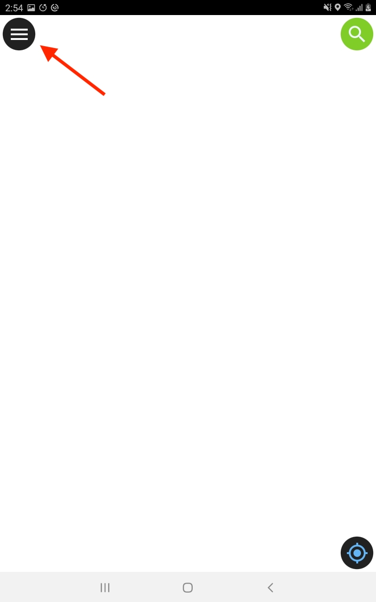
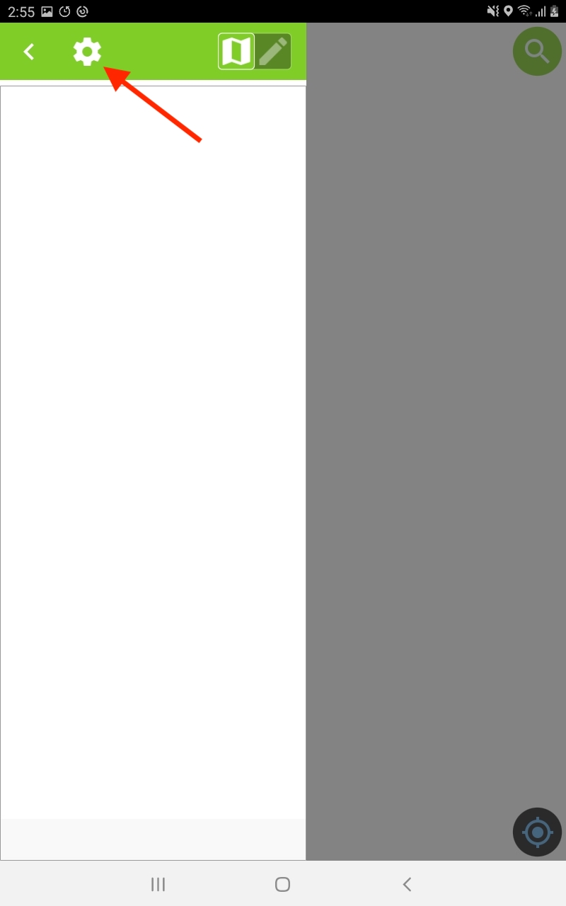
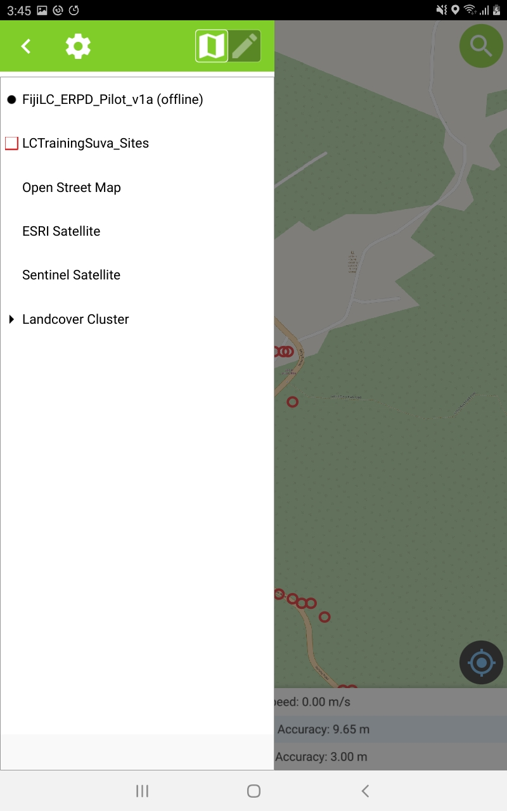
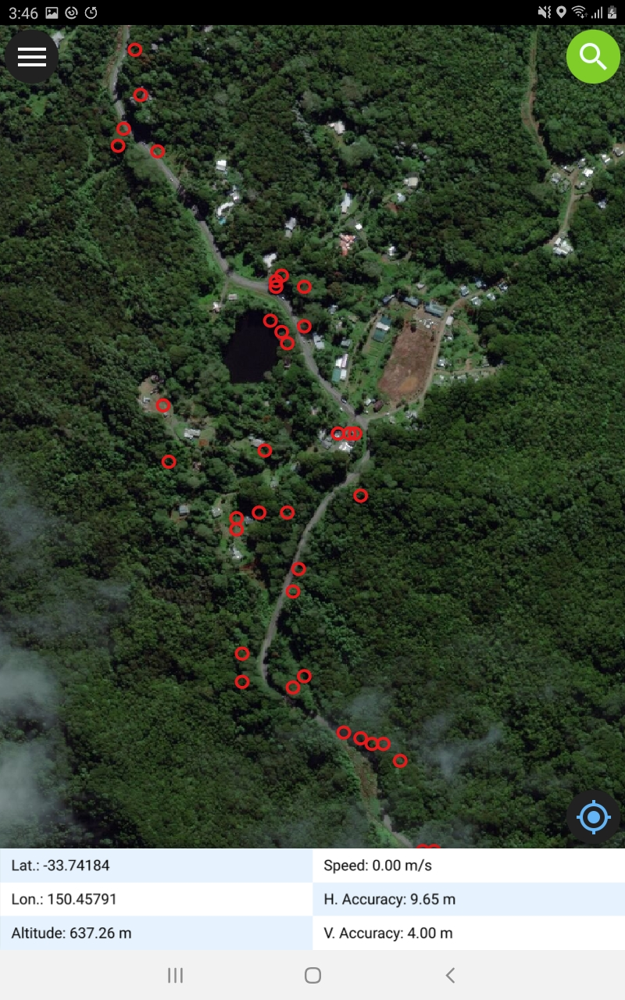
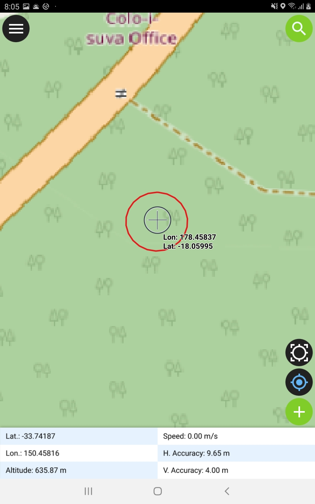
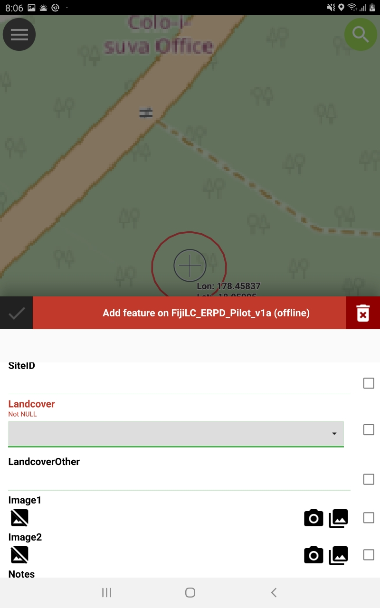
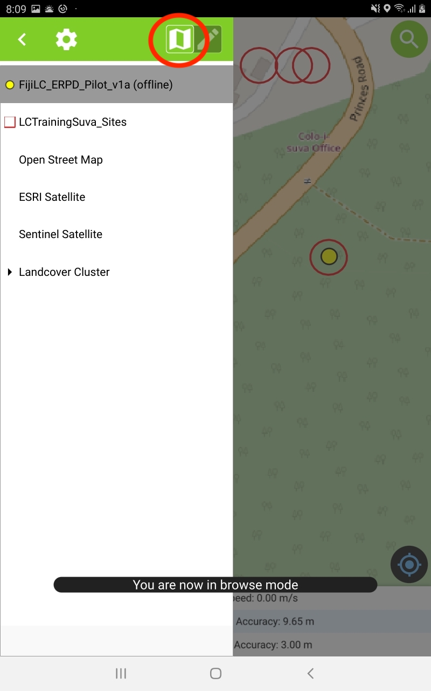

## Overview

Ground truth data is required for landcover mapping produced from satellite images in order to 'train' the classification algorithm, and to calculate the accuracy of the final map. Ground truth data consists of data points with an accurate location and a label from a predefined list of known landcover types. This tutorial guides the user through ground-truth data collection for a training area in Suva, Fiji.

## Prerequisites

The latest version of QField must be installed on your Android device. You can install this from the Google Play Store. You should also have the latest version of the QGIS project for the ground truth data exercise preloaded onto your device **(LCTrainingSuva\_v1a\_qfield.qgs)**. Ask your instructor if you do not have this file installed.

## Collecting Ground Truth Data

This section goes through the steps to collect ground truth data around the training site.

### 1. Open the QField Project

Start QField on your device. If you receive the welcome screen (Figure 0), tap on **Open local project**. 

{width=40%} 

If you are in the main QField screen, to open the welcome screen tap the **Menu button** (Figure 1):

{width=40%} 

Then tap the **Options button** (Figure 2) to open the welcome screen. You can now tap  **Open local project**.

{width=40%}

Navigate to the **LCTrainingSuva\_v1a\_qfield.qgs** file and tap on it to open it. If you are unsure where this file is located in your device, ask your instructor. 

If you have opened the project correctly, your device should display an image similar to Figure 3 below. 

{width=40%}

### 2. Working with the GPS

To centre the map on your current GPS location, tap the blue GPS icon  {width=7%} in the bottom right-hand corner. If the screen goes white, it probably means you are not in the study area or your GPS is not giving an accurate location. 

QField can display GPS information dynamically on the screen. To turn this display on, tap and hold the blue GPS icon until you receive a menu. Tick on the *Show Position Information*. The map screen should now have a tablet at the bottom showing GPS information (Figure 4).

{width=40%}

The field of particular interest is the *H. Accuracy*, or horizontal accuracy, which tells you how close the given latitude and longitude is from the true value on the ground. If you are relying on the GPS to position yourself on the map for ground truth data collection, This value should be as small as possible (e.g. less than 5 m). Poor accuracy can be caused by working in or around buildings, working under dense tree canopy, or poor satellite configuration. Make sure you understand how poor horizontal accuracy could impact on the ground truth data collection. 

### 3. Available Map Layers

The project contains a number of layers relevant to collecting ground truth data. To see the available layers, tap the menu button, and the available layers should be displayed similar to Figure 5. 

{width=40%}

The layers available are:

* **FijiLC_ERPD_Pilot_v1a** (used to record ground truth data)
* **LCTraingSuva_Sites** (random sites where ground truth data can be collected)
* **Open Street Map** (topographic map)
* **ESRI Satellite** (high resolution image)
* **Sentinel Satellite** (low resolution image that will be used to produce the landcover)
* **Landcover Cluster** (an *untrained* landcover map to aid in ground truth data collection)

These layers will be discussed in more detail below. By default, all layers are turned on, however, only the top-most image layer (Open Street Map) obscures the other layers. To turn off the **Open Street Map layer**, tap and hold the layer until a small option window appears, and then untick the **Show on map canvas** option. The next image layer in the list *(ESRI Satellite)* should now be visible (similar to Figure 6).

{width=40%}

### 4. Labelling Pre-Defined Sites

The **Landcover Cluster** represents an *untrained* landcover map. Areas with the same colour are more likely to have the same landcover, but not always. This cluster map was used to generate random sites for ground truth data collection represented by the **LCTraingSuva_Sites** layer. The objective is to label these sites with their *true* landcover class.

Ideally, you would visit each of these sites in order to understand the correct landcover. However, this is not always possible due to difficult or inaccessible terrain or vegetation. There may also be legal constraints preventing access to the sites. You must therefore make as best determination as possible of the landcover at these sites either by an appropriate distance viewpoint, local knowledge, and reference to the provided layers or other information you may have. 

Tap the menu button, then tap the **FijiLC_ERPD_Pilot_v1a** layer so it is highlighted. Then tap the **Digitise Mode** button as shown in Figure 7.

{width=40%}

Move into one of the circled sites closest to your current locations. If you can't access the circle, then move as close as possible so that you have a sense of the landcover on that site. Drag the map so the crosshairs are roughly centres in the site as shown in Figure 8.

{width=40%}

Tap the add feature button {width=7%} in the bottom right-hand corner to add a new ground truth record at this location. If this button is not on your screen then you are not in digitize mode. A form should be displayed similar to Figure 9.

{width=40%}

The form contains a number of fields you can edit:

* **SiteID** (optional): If you have pre-defined sites that are labelled, enter the site ID here.
* **LandcoverType** (required): Choose the most dominant landcover for this site considering the complete area (red circle). Refer to the high resolution ESRI Satellite Image if you need help. If the landcover it not on the list, choose **Other** - you will be required to provide this type in the next field. If you want to mark a site but not record a landcover type, choose **Not Recorded**.
* **LandcoverOther** (conditional): If your landcover type was **Other**, then you need are required to enter the landcover type here.
* **Image1, Image 2** (optional): You can capture up to 2 images by tapping the camera icon.
* **Notes** (optional): Add any notes about the site.

Other fields are read-only and represent data captured from the device itself - they can't be changed:

* **Bearing**: If you device has a compass, this will record the direction you are facing when you added the record.
* **HAccuracy**: The horizontal accuracy of the GPS when the site was recorded.
* **UserID**: The default QField user ID for this device (this helps identify who captured the record)
* **Timestamp**: The data and time when the site was recorded.

Once you have finished, tap the tick button at the top left of the form (Figure 10). If the tick button is greyed out then you have not filled out all of the required fields. If you want to discard your record then click the trash can button at the top right of the form.

{width=40%}

The recorded point will now be shown as a yellow symbol (Figure 11).

{width=40%}

Once you have finished recording sites, tap the menu button and then leave digitizing mode by tapping the browse button (Figure 12).

{width=40%}

### 5. Labelling Opportunistic Sites

When in the field, you may come across unexpected or rare landcover types that do not have pre-defined sites. You may also wish to capture extra ground truth sites for common landcover types. The process for capturing these sites is the same as for the pre-defined sites, however, you will not have a site guide. Ensure you position the captured feature at the correct location by using your GPS (if you can access the site) and with reference to the other layers.

